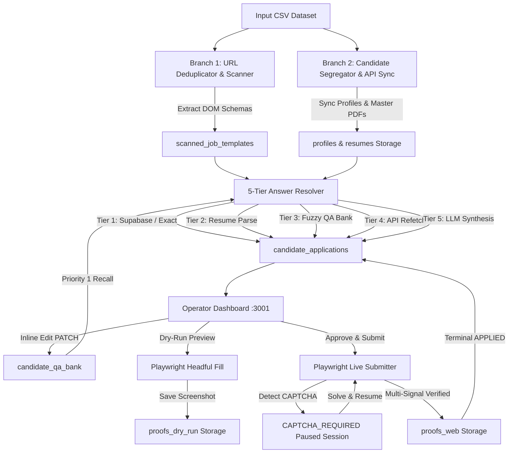
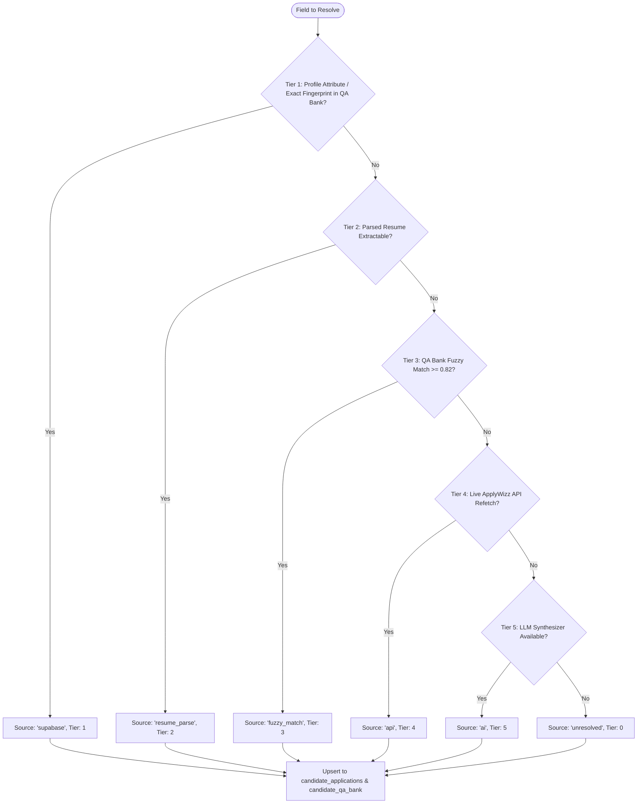

# Codebase Technical Analysis & Living Architecture Map

**Project:** Greenhouse Job Application Automation (Phase V2)  
**Repository:** `yaswanthnaidu-yalla-applywizz/greehouse_apply`  
**Current State:** Phase V2 Completed (Cloud Persistence, 5-Tier Waterfall, Playwright Submissions, CAPTCHA Resume, Proof Lifecycle, UI Restyle)  
**Last Updated:** 2026-09-08  

---

## 1. Executive Summary

The **Greenhouse Job Application Automation System (V2)** is an enterprise-grade, cloud-backed automation platform designed to eliminate the manual bottleneck of high-volume job applications across Greenhouse ATS boards (`boards.greenhouse.io`, `job-boards.greenhouse.io`, `app.greenhouse.io/embed/...`, and `grnh.se/...` shortlinks).

The system coordinates an end-to-end multi-phase architecture:
1. **Branch 1 (Unique Link Processing & Headless DOM Scanning):** Deduplicates raw job postings from an input CSV, strips tracking parameters, resolves HTTP redirects/shortlinks, and uses a configurable Playwright worker pool (with 3–6s randomized jitter) to scrape DOM schemas, input types, required flags, select/radio options, and detect cascading conditional fields, persisting records to Supabase `scanned_job_templates`.
2. **Branch 2 (Candidate Ingestion & Cloud Profile Sync):** Segregates records by candidate `Applywizz ID`, synchronizes profiles and master PDF resumes via the ApplyWizz API, stores master resumes in Supabase Storage `resumes` bucket, parses resume text via `pdf-parse`, and upserts profiles into Supabase `profiles`.
3. **5-Tier Waterfall Answer Resolution:** Resolves form fields using a prioritized waterfall short-circuiting on the first resolved tier:
   - **Tier 1 (Supabase / Exact Match):** Profile fields & exact question fingerprint match in `candidate_qa_bank` (`source: 'supabase'`, `resolvedByTier: 1`).
   - **Tier 2 (Resume Parse Extraction):** Structured data extracted from parsed PDF resumes (`source: 'resume_parse'`, `resolvedByTier: 2`).
   - **Tier 3 (QA Bank Fuzzy Match):** Fuse.js fuzzy matching on question labels ($\ge 0.82$) (`source: 'fuzzy_match'`, `resolvedByTier: 3`).
   - **Tier 4 (ApplyWizz API Refetch):** Live API refetch for updated candidate details (`source: 'api'`, `resolvedByTier: 4`).
   - **Tier 5 (LLM Synthesis):** OpenRouter / Gemini / OpenAI synthesis (`source: 'ai'`, `resolvedByTier: 5`).
4. **Interactive Operator Dashboard & Inline Review:** React split-screen cockpit styled with a neo-brutalist / modern retro aesthetic. Allows operators to modify pre-filled answers inline (`PATCH /api/applications/:id/fields/:fieldId`), writing back to `candidate_qa_bank` with `source: 'manual'` for future Tier 1 priority.
5. **Playwright Submission Engine & CAPTCHA Resumption:** Executes headless or headful form filling with humanized jitter. Detects Cloudflare Turnstile, reCAPTCHA, and hCaptcha iframes, pauses the session in `CAPTCHA_REQUIRED` state for operator solving, and resumes automatically.
6. **Multi-Signal Verification & Web Proof Capture:** Verifies successful submissions via page titles, DOM confirmation tokens, and URL redirects. Captures full-page screenshots (`page.screenshot({ fullPage: true })`), uploads them to Supabase Storage `proofs_web`, and transitions the application record to `APPLIED`.

---

## 2. Repository Structure

```
greehouse_apply/
├── .env                                       # Local environment variable configuration
├── .env.example                               # Environment template with provider defaults
├── .gitignore                                 # Git ignore definitions (node_modules, dist, output, etc.)
├── package.json                               # Dependencies, scripts (db:migrate, scan, sync, resolve, dry-run, submit, test)
├── package-lock.json                          # Pinned dependency tree lockfile
├── tsconfig.json                              # TypeScript strict compiler configuration (ES2022 / NodeNext)
├── STATE.md                                   # Living project state and phase completion tracking
├── CODEBASE_ANALYSIS.md                       # Living technical architectural map and codebase specification
├── README.md                                  # Platform overview, architecture diagrams, and quickstart guide
├── greenhouse_only_applywizz_prod(in).csv      # Production input CSV dataset
│
├── project docs/                              # Project technical specifications and requirements
│   ├── V1/                                    # Phase V1 Architecture & Implementation Docs
│   └── V2/                                    # Phase V2 Architecture, TRD, Schema, UI/UX Docs
│       ├── 04-ui-ux-v2-refined.md             # Refined UI/UX design specifications
│       ├── V2-backend-schema.md               # Supabase DDL schema, indexes, and Storage bucket architecture
│       ├── V2-implementation.md               # Phased build roadmap and verification checklists
│       ├── V2-prd.md                          # Phase V2 Product Requirements Document
│       ├── V2-trd.md                          # Phase V2 Technical Requirements Document
│       └── V2-workflow.md                     # Phase V2 End-to-End workflow sequences
│
├── src/                                       # Core TypeScript application source code
│   ├── index.ts                               # Unified master pipeline entrypoint & dashboard launcher
│   ├── config/
│   │   └── env.ts                             # Environment parsing, Zod validation, and active LLM key resolution
│   ├── types/
│   │   └── index.ts                           # Comprehensive TypeScript domain types and data contracts
│   │
│   ├── db/                                    # Supabase Persistence & Migration Layer (Phase V2-1)
│   │   ├── client.ts                          # Resilient Supabase client instance
│   │   ├── migrate.ts                         # Automated database DDL migration & bucket provisioning
│   │   ├── profiles.ts                        # Profiles table CRUD helpers
│   │   ├── templates.ts                       # Scanned job templates CRUD helpers
│   │   ├── applications.ts                    # Candidate applications CRUD helpers
│   │   ├── qaBank.ts                          # Candidate Q&A bank CRUD helpers & fingerprint generator
│   │   └── index.ts                           # DB layer barrel export
│   │
│   ├── scanner/                               # Branch 1: Link processing and Playwright scanning engine
│   │   ├── csvDeduplicator.ts                 # Stream-parsing, URL sanitization & grnh.se concurrent resolution
│   │   ├── playwrightScanner.ts               # Worker pool, DOM extractor, cascading option probe & 404 detector
│   │   ├── exportScannedJobs.ts               # Structured JSON and flattened CSV template serializer
│   │   ├── runScan.ts                         # Standalone CLI execution runner for Branch 1
│   │   └── index.ts                           # Scanner module barrel export
│   │
│   ├── candidate/                             # Branch 2: Candidate segregation and profile sync
│   │   ├── applywizzClient.ts                 # ApplyWizz API client, 3x backoff retry & PDF resume downloader
│   │   ├── segregator.ts                      # CSV row grouper, batch synchronizer & segment exporter
│   │   ├── runCandidateSync.ts                # Standalone CLI execution runner for candidate sync
│   │   └── index.ts                           # Candidate module barrel export
│   │
│   ├── resolver/                              # 5-Tier Waterfall Answer Resolution Engine (Phase V2-2)
│   │   ├── answerResolver.ts                  # 5-Tier resolution orchestrator & Supabase application upsert
│   │   ├── profileMatcher.ts                  # Tier 1 direct attribute matcher
│   │   ├── llmSynthesizer.ts                  # Tier 5 LLM prompt synthesizer (OpenRouter/Gemini/OpenAI)
│   │   ├── qaBank.ts                          # SHA-256 question fingerprinting & QA bank operations
│   │   ├── runResolver.ts                     # Standalone CLI runner with verbose tier telemetry
│   │   └── index.ts                           # Resolver module barrel export
│   │
│   ├── submitter/                             # Playwright Submission Engine & Verification (Phases V2-4, V2-5)
│   │   ├── formFiller.ts                      # Multi-control DOM population with humanized jitter & cascade loop
│   │   ├── cascadeDetector.ts                 # Helper detecting newly rendered DOM fields after mutations
│   │   ├── dryRun.ts                          # Headful preview runner with screenshot capture
│   │   ├── runUserApplication.ts              # Headful user preview CLI script
│   │   ├── liveSubmit.ts                      # Automated submitter with CAPTCHA check & multi-signal verification
│   │   ├── captchaResume.ts                   # In-memory paused browser session manager for manual CAPTCHA solving
│   │   ├── proofCapture.ts                    # Full-page screenshot proof capture & Supabase Storage uploader
│   │   ├── runLiveSubmitCli.ts                # Standalone CLI execution runner for live submissions
│   │   └── index.ts                           # Submitter module barrel export
│   │
│   ├── server/                                # Backend presentation REST API
│   │   ├── routes/
│   │   │   ├── applications.ts                # Application status, detail, and inline field PATCH routes
│   │   │   └── submissions.ts                 # Dry-run, live submit, and CAPTCHA resume routes
│   │   └── index.ts                           # Express REST API application
│   │
│   └── orchestrator/                          # Pipeline Coordination
│       ├── pipeline.ts                        # Master Pipeline class
│       ├── runPipeline.ts                     # Standalone CLI runner
│       └── index.ts                           # Orchestrator barrel export
│
├── dashboard/                                 # Frontend Operator Dashboard (Neo-Brutalist Aesthetic)
│   ├── App.tsx                                # Root container with navigation tabs, stats, and split-screen layout
│   ├── CandidateList.tsx                      # Left sidebar candidate directory with search & status badges
│   ├── JobQueueView.tsx                       # Right pane top: Tabbed candidate job queue & DifficultyBadges
│   ├── FormRenderer.tsx                       # Right pane main: Pre-filled form with inline edit and submission controls
│   ├── types.ts                               # Dashboard frontend interface contracts
│   ├── components/                            # Modular React UI Components
│   │   ├── ApplicationStatusBadge.tsx         # Real-time status badge with 2s polling during APPLYING
│   │   ├── DifficultyBadge.tsx                # Easy (green), Medium (blue), Hard (coral) complexity pill
│   │   ├── EditableFormField.tsx              # Inline editable form field with Enter/Esc shortcuts & PATCH
│   │   ├── SourceBadge.tsx                    # Color-coded source attribution badge (supabase, ai, manual, unresolved)
│   │   ├── SubmissionControls.tsx             # Action buttons (Approve & Submit, Dry-Run, Proof Viewer)
│   │   └── ProofViewer.tsx                    # High-resolution screenshot proof viewer modal with image download
│   └── public/
│       └── index.html                         # Standalone HTML bundle with React 18 CDN & Tailwind CSS
│
└── tests/                                     # Automated Test Suites (135/135 passing)
    ├── e2eIntegration.test.ts                 # Master 7-checkpoint E2E integration test suite
    ├── proofLifecycle.test.ts                 # Phase V2-5 Proof capture & status lifecycle test suite
    ├── cascading.test.ts                      # Phase V2-4b Cascading field detection test suite
    ├── submissions.test.ts                    # Phase V2-4 Submissions, CAPTCHA & session resume test suite
    ├── resolverWaterfall.test.ts              # Phase V2-2 5-Tier waterfall resolution test suite
    └── applicationsPatch.test.ts              # Phase V2-3 Inline review & QA bank PATCH test suite
```

---

## 3. Core Architecture & Data Flow



---

## 4. 5-Tier Waterfall Resolution Logic



---

## 5. Automated Test Matrix

All 6 test suites pass with **100% success rate (135/135 tests passing, 0 TypeScript errors)**:

| Test Suite | File | Tests Passed | Status |
| :--- | :--- | :---: | :---: |
| **Phase V2-6: Master E2E Integration Suite** | `tests/e2eIntegration.test.ts` | **32 / 32** | ✅ Passed |
| **Phase V2-5: Web Proof Capture & Lifecycle** | `tests/proofLifecycle.test.ts` | **32 / 32** | ✅ Passed |
| **Phase V2-4b: Cascading Field Detection** | `tests/cascading.test.ts` | **16 / 16** | ✅ Passed |
| **Phase V2-4: Submissions & Session Resume** | `tests/submissions.test.ts` | **25 / 25** | ✅ Passed |
| **Phase V2-2: 5-Tier Waterfall Resolution** | `tests/resolverWaterfall.test.ts` | **17 / 17** | ✅ Passed |
| **Phase V2-3: Inline Edit & QA Bank PATCH** | `tests/applicationsPatch.test.ts` | **13 / 13** | ✅ Passed |
| **TypeScript Typecheck** | `npm run typecheck` | **0 errors** | ✅ Passed |
