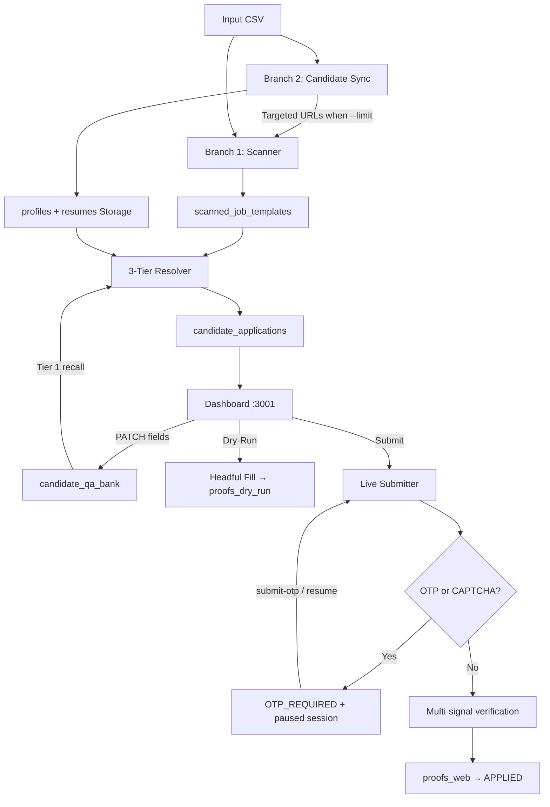
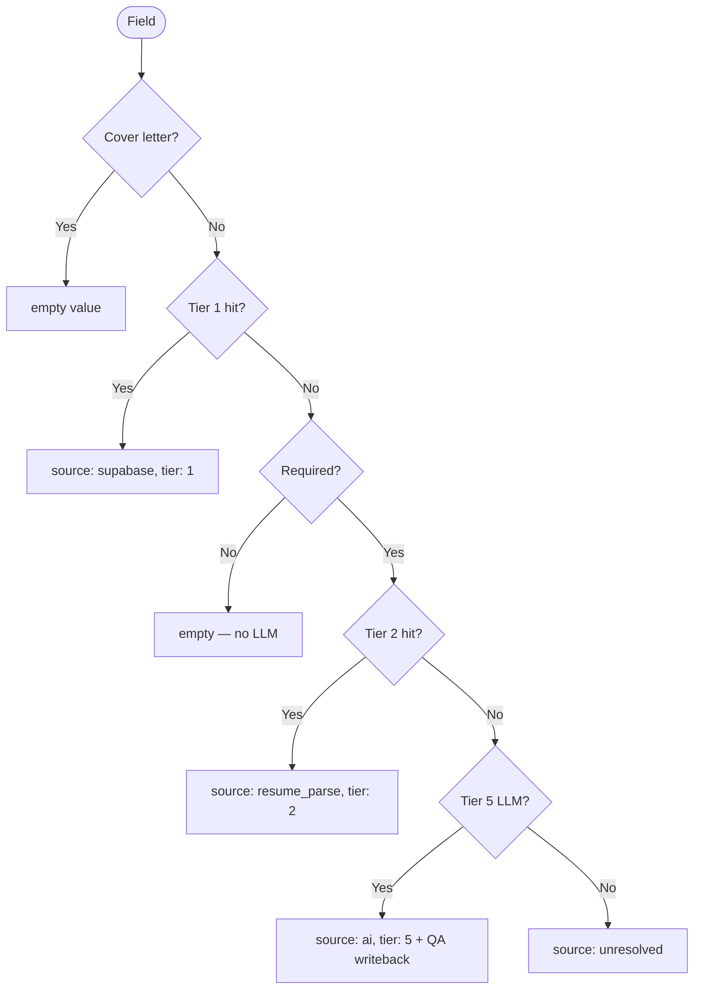

# Codebase Technical Analysis & Planning Reference

**Project:** Greenhouse Job Application Automation (Phase V2)  
**Repository:** `yaswanthnaidu-yalla-applywizz/greehouse_apply`  
**Purpose of this document:** Single source of truth for **Cursor Plan-mode sessions**. Use it to scope work, locate files, understand constraints, and produce implementation plans without re-exploring the repo each time.  
**Current state:** Phase V2 complete — cloud persistence, 3-tier offline waterfall, Playwright submissions, OTP/CAPTCHA pause & resume, proof lifecycle, operator dashboard  
**Last verified:** 2026-09-09 (`npm run typecheck` passes; 75 TypeScript source files)  
**Companion docs:** `handover.md` (session context), `AGENTS.md` + `.cursorrules` (agent rules), `project docs/V2/` (original specs)

---

## 0. How to Use This Document (Planning-Only Workflow)

When using Cursor **only for planning** (not implementation):

1. **Start every planning session** by referencing this file: *"Read CODEBASE_ANALYSIS.md sections X and Y, then plan …"*
2. **Scope changes** using Section 12 (Backlog) and Section 13 (Technical Debt) — do not rediscover issues from scratch.
3. **Identify touch files** via Section 4 (Module Map) and Section 14 (Modification Cookbook).
4. **Validate plans** against Section 11 (Hard Constraints) — especially ApplyWizz API, cover letters, phone formatting, screenshots.
5. **Output plans in chat** (not new `.md` files per `AGENTS.md`).
6. **Hand off implementation** to your non-Cursor workflow with: affected files, ordered steps, test commands, and rollback notes.

### Planning Session Checklist

| Step | Action |
| :--- | :--- |
| 1 | Confirm which pipeline stage is affected (scan / sync / resolve / dashboard / submit) |
| 2 | List exact files from Module Map |
| 3 | Check if dashboard `index.html` mirror is required |
| 4 | Note Supabase migration needs (`src/db/migrations/`) |
| 5 | Specify test file(s) from Section 10 |
| 6 | Flag external API calls (ApplyWizz = user permission required) |

---

## 1. Executive Summary

The **Greenhouse Job Application Automation System (V2)** automates high-volume job applications on Greenhouse ATS boards (`boards.greenhouse.io`, `job-boards.greenhouse.io`, `app.greenhouse.io/embed/...`, `grnh.se/...` shortlinks).

### End-to-End Pipeline

| Phase | Module | Output |
| :--- | :--- | :--- |
| **Branch 1** | `src/scanner/` | DOM form schemas → `scanned_job_templates` + `output/scanned_jobs.json` |
| **Branch 2** | `src/candidate/` | ApplyWizz profiles + PDF resumes → `profiles` + Storage `resumes` |
| **Resolution** | `src/resolver/` | Pre-filled answers → `candidate_applications` + `output/resolved_applications.json` |
| **Review** | `dashboard/` + `src/server/` | Operator inline edits → `candidate_qa_bank` |
| **Submit** | `src/submitter/` | Playwright fill/submit → proofs in Storage `proofs_web` |

### 3-Tier Offline Waterfall (active tiers only)

```
Field → Cover letter? → skip (empty)
      → Tier 1: Supabase profile heuristics + exact QA bank fingerprint
            → optional + miss? → leave empty (no LLM)
      → Tier 2: Parsed resume text + /URI hyperlink extraction
      → Tier 5: Ollama llama3.1 synthesis + QA bank writeback
      → unresolved
```

**Inactive / removed:** Tier 3 (`tier3FuzzyMatch.ts` — file exists, not called), Tier 4 (`tier4ApiRefetch.ts` — **deleted**).

### Key Operational Features

| Feature | Implementation |
| :--- | :--- |
| Early dashboard boot | Express on port 3001 before ingestion completes |
| Targeted scanning | With `--limit`, Branch 2 runs first; only assigned job URLs scanned |
| Scan cache reuse | URLs in `output/scanned_jobs.json` skipped on reruns |
| Pilot mode | `--limit=N --maxJobs=M` caps candidates/jobs; skips V1 migration |
| Job complexity filter | Jobs with ≥ `MAX_JOB_QUESTIONS` fields excluded (default **23**) |
| Local fallback | No Supabase → in-memory DB + local `resumes/` |
| Demo fixtures | `AWL-YASWANTH` merged via `src/dashboard/demoFixtures.ts` |
| OTP operator flow | `OTP_REQUIRED` status, in-memory paused Playwright sessions |
| Company email priority | `getCompanyEmail()` in `profiles.ts`; used in Tier 1 + ingestion |
| Yes/No enforcement | `tier1Supabase.ts` + `llmSynthesizer.isBinaryYesNoQuestion()` |

---

## 2. Quick Reference

### Commands

```powershell
npm run typecheck          # Must pass (0 errors) before any release
npm run build              # tsc compile to dist/
npm start                  # Full pipeline + dashboard
npm start -- --limit=3 --maxJobs=3 --verbose
npm start -- --limit=3 --maxJobs=3 --skip-migrate --skip-sync --skip-scan  # Rerun resolve only
npm run dashboard          # API + SPA only (no pipeline)
npm run scan               # Branch 1 only
npm run sync:candidates    # Branch 2 only
npm run resolve            # Resolution only
npm run dry-run            # Headful form preview CLI
npm run submit             # Live submit CLI
npm run db:migrate         # V1→V2 migration
npm run db:backfill-company-email
npx tsx src/db/clearCandidateData.ts   # Wipe cache + Supabase rows
npm test                   # Master E2E (32 checkpoints)
npx tsx tests/submissions.test.ts
npx tsx tests/verifyEmailAndYesNo.test.ts
npx tsx tests/verifyFourIssues.test.ts
```

### URLs & Ports

| Resource | Value |
| :--- | :--- |
| Dashboard | `http://localhost:3001` (`.env` `PORT=3001`; Zod default is 3000) |
| Ollama | `http://127.0.0.1:11434/v1` — model `llama3.1:latest` |
| ApplyWizz API | `https://www.apply-wizz.me/api/get-client-details?applywizz_id=` — **ingestion only, user permission required** |

### Demo Candidate (dashboard testing without full pipeline)

| Field | Value |
| :--- | :--- |
| ApplyWizz ID | `AWL-YASWANTH` |
| Name | Yaswanth Naidu Yalla |
| Job URL | `https://job-boards.greenhouse.io/pmg/jobs/8765658002?gh_src=lcrm1uib2us` |
| Resume | `resumes/my-resume.pdf` (must exist locally) |

### Local Data Directories

| Path | Contents |
| :--- | :--- |
| `cache/profiles/{applywizzId}.json` | ApplyWizz API response cache (Branch 2) |
| `cache/parsed_resumes/{applywizzId}.json` | Tier 2 parse cache (disk fallback) |
| `output/candidate_segments.json` | Branch 2 segments |
| `output/scanned_jobs.json` | Branch 1 templates |
| `output/resolved_applications.json` | Resolver output |
| `resumes/` | Local PDF cache |

---

## 3. Repository Structure

```
greehouse_apply/
├── .cursorrules / AGENTS.md / handover.md     # Agent rules & session context
├── CODEBASE_ANALYSIS.md                       # This file — planning SSOT
├── package.json                               # Scripts & dependencies
├── tsconfig.json                              # strict, ES2022, NodeNext
├── greenhouse_only_applywizz_prod(in).csv      # Production input CSV
│
├── project docs/V1/                           # Phase V1 specs (superseded)
├── project docs/V2/                           # Phase V2 specs (PRD, TRD, workflow, schema, UI)
│
├── src/
│   ├── index.ts                               # Master pipeline entry (V2-6)
│   ├── config/env.ts                          # Zod-validated env
│   ├── types/index.ts                         # Domain types (note: stale ApplicationStatus — see §13)
│   │
│   ├── db/                                    # Supabase + local fallback
│   │   ├── schema.sql                         # 5 tables DDL
│   │   ├── migrations/                        # 001 company_email, 002 OTP_REQUIRED rename
│   │   ├── client.ts, storage.ts, migrate.ts
│   │   ├── profiles.ts                        # getCompanyEmail(), CRUD
│   │   ├── templates.ts, applications.ts, qaBank.ts, resumeParsed.ts
│   │   ├── backfillCompanyEmail.ts, clearCandidateData.ts
│   │   └── index.ts
│   │
│   ├── scanner/                               # Branch 1
│   │   ├── csvDeduplicator.ts                 # Dedup, sanitize, grnh.se resolve (pool: 25)
│   │   ├── playwrightScanner.ts               # Worker pool, DOM extract, cascade probe
│   │   ├── exportScannedJobs.ts, runScan.ts
│   │   └── index.ts
│   │
│   ├── candidate/                             # Branch 2
│   │   ├── applywizzClient.ts                 # API client, cache, PDF download
│   │   ├── segregator.ts                      # CSV grouper, 10-way concurrent sync
│   │   ├── runCandidateSync.ts
│   │   └── index.ts
│   │
│   ├── resolver/                              # 3-tier waterfall
│   │   ├── answerResolver.ts                  # Orchestrator: T1 → T2 → T5
│   │   ├── tier1Supabase.ts                   # Profile heuristics, Yes/No, QA bank
│   │   ├── tier2ResumeParse.ts                # pdf-parse + /URI links
│   │   ├── tier5LLM.ts                        # LLM + QA writeback
│   │   ├── llmSynthesizer.ts                  # Ollama/OpenRouter/Gemini/OpenAI
│   │   ├── fingerprint.ts, qaBank.ts
│   │   ├── tier3FuzzyMatch.ts                 # INACTIVE
│   │   ├── profileMatcher.ts                  # Legacy V1 (tests only)
│   │   ├── runResolver.ts
│   │   └── index.ts
│   │
│   ├── submitter/                             # Playwright submission
│   │   ├── formFiller.ts                      # Fill, jitter, cascade (≤3 cycles)
│   │   ├── cascadeDetector.ts
│   │   ├── dryRun.ts, liveSubmit.ts           # OTP pause, PAUSED_SESSIONS map
│   │   ├── captchaResume.ts, proofCapture.ts
│   │   ├── runUserApplication.ts, runLiveSubmitCli.ts
│   │   └── index.ts
│   │
│   ├── server/                                # Express REST + static dashboard
│   │   ├── index.ts                           # Artifact loader, demo fixture merge
│   │   └── routes/applications.ts, submissions.ts
│   │
│   ├── dashboard/demoFixtures.ts              # AWL-YASWANTH demo data
│   │
│   └── orchestrator/                          # V1 legacy (superseded by src/index.ts)
│
├── dashboard/
│   ├── public/index.html                      # **RUNTIME SPA** — inline React + Babel + Tailwind CDN
│   ├── App.tsx, CandidateList.tsx, JobQueueView.tsx, FormRenderer.tsx, types.ts
│   └── components/                            # Source references — must mirror index.html
│
└── tests/                                     # 10 test files (see §10)
```

---

## 4. Architecture & Data Flow



### Master Pipeline Order (`src/index.ts`)

| Step | Action | Skip Flag |
| :---: | :--- | :--- |
| 0 | Boot Express dashboard | `--skip-dashboard` |
| 1 | Ensure Supabase storage buckets | — |
| 2 | V1 cache → Supabase migration | `--skip-migrate` (auto-skipped with `--limit`) |
| 3a | Branch 2: Candidate sync + resume upload | `--skip-sync` |
| 3b | Branch 1: Targeted form scanning (cache-aware) | `--skip-scan` |
| 4 | 3-tier resolution + Supabase upsert | `--skip-resolve` |
| 5 | Dashboard ready | — |

**Fallback:** If input CSV missing, synthesizes segments from `cache/profiles/` + existing `scanned_jobs.json`.

---

## 5. Module Map (Planning Touch Points)

| Module | Primary Files | When to Touch |
| :--- | :--- | :--- |
| **Env / config** | `src/config/env.ts` | New env vars, defaults, provider switching |
| **Types** | `src/types/index.ts`, `dashboard/types.ts`, `src/db/applications.ts` | New field types, status values |
| **Profiles / email** | `src/db/profiles.ts`, `src/candidate/applywizzClient.ts` | Contact fields, `getCompanyEmail()` |
| **Tier 1 resolution** | `src/resolver/tier1Supabase.ts` | Profile heuristics, Yes/No, demographics |
| **Tier 2 resolution** | `src/resolver/tier2ResumeParse.ts` | PDF parsing, hyperlink extraction |
| **Tier 5 / LLM** | `src/resolver/tier5LLM.ts`, `src/resolver/llmSynthesizer.ts` | Prompts, binary enforcement, providers |
| **Resolver orchestration** | `src/resolver/answerResolver.ts` | Waterfall order, optional-field short-circuit |
| **Scanner** | `src/scanner/playwrightScanner.ts`, `csvDeduplicator.ts` | New field types, 404 detection, jitter |
| **Candidate sync** | `src/candidate/segregator.ts`, `applywizzClient.ts` | Concurrency, cache, API mapping |
| **Form filling** | `src/submitter/formFiller.ts` | Select2, React-Select, phone sweep, cover letter skip |
| **Live submit** | `src/submitter/liveSubmit.ts` | OTP detect, pause/resume, verification |
| **Proof capture** | `src/submitter/proofCapture.ts` | Screenshot before browser close |
| **REST API** | `src/server/index.ts`, `routes/*.ts` | New endpoints, artifact loading |
| **Dashboard UI** | `dashboard/components/*.tsx` **AND** `dashboard/public/index.html` | Any operator UI change |
| **DB schema** | `src/db/schema.sql`, `src/db/migrations/` | New columns, status values |
| **Demo data** | `src/dashboard/demoFixtures.ts` | Test candidate for dashboard |

---

## 6. 3-Tier Resolution Detail

### Waterfall Logic (`answerResolver.ts`)



### Fingerprinting (`fingerprint.ts`)

```
fingerprint = SHA-256(normalize(label) + "|" + normalize(type))[0:16]
```

`normalizeText()` lowercases, strips punctuation/asterisks, collapses whitespace.

### Source Attribution

| Tag | Tier | Origin |
| :--- | :---: | :--- |
| `supabase` | 1 | Profile match or exact QA bank fingerprint |
| `resume_parse` | 2 | PDF text or `/URI` hyperlink |
| `ai` | 5 | LLM synthesis |
| `manual` | 1* | Dashboard PATCH → QA bank |
| `unresolved` | — | Required field, all tiers missed |

*Manual edits stored in `candidate_qa_bank` with `source: 'manual'`; recalled at Tier 1.

### Tier 1 Heuristic Order (`tier1Supabase.ts`)

1. Cover letter → empty (policy)
2. Resume file path
3. First/last name, email (`getCompanyEmail`), phone (strip `+1`)
4. LinkedIn, GitHub, website
5. **Relocation / same-city** → Yes/No (before location string match)
6. Location / city
7. Work authorization, sponsorship
8. Demographics (gender, race, veteran, disability)
9. Education / experience fields
10. Exact QA bank fingerprint lookup

---

## 7. Supabase Schema

Defined in `src/db/schema.sql`. Five tables, RLS enabled (permissive for service-role backend).

| Table | Purpose | Key Columns |
| :--- | :--- | :--- |
| `profiles` | Candidate master data | `applywizz_id` (unique), `company_email`, `education`/`work_experience` (JSONB), `resume_storage_path`, `raw_api_payload` |
| `scanned_job_templates` | Form schema cache | `job_url` (unique), `fields_schema` (JSONB), `field_count` (generated), `is_expired` |
| `candidate_resume_parsed` | Tier 2 cache | `applywizz_id` (unique FK), `raw_text`, `structured` (JSONB) |
| `candidate_qa_bank` | Q&A memory | `question_fingerprint`, `source` (`ai` \| `manual`), unique `(applywizz_id, fingerprint)` |
| `candidate_applications` | Application state | `status`, `resolved_fields` (JSONB), `proof_web_url`, unique `(applywizz_id, job_url)` |

### Migrations (apply manually in Supabase SQL Editor)

| File | Purpose |
| :--- | :--- |
| `001_add_company_email.sql` | Adds `profiles.company_email` column + index |
| `002_rename_captcha_to_otp_required.sql` | Renames `CAPTCHA_REQUIRED` → `OTP_REQUIRED` |

### Storage Buckets

| Bucket | Visibility | Contents |
| :--- | :---: | :--- |
| `resumes` | Private | `{applywizzId}_resume.pdf` |
| `proofs_web` | Public | `{applicationId}_web.png` |
| `proofs_dry_run` | Public | `{applicationId}_dryrun.png` |

### Application Status Lifecycle

```
READY_FOR_REVIEW → DRY_RUN_COMPLETE → APPLYING → APPLIED
                                              ↘ FAILED
                                              ↘ OTP_REQUIRED → (submit-otp / resume-submission) → APPLIED | FAILED
EXPIRED (404 / closed posting)
```

Canonical type: `src/db/applications.ts` → `ApplicationStatus`.

---

## 8. REST API Reference

Base: `http://localhost:3001`

### Core (`src/server/index.ts`)

| Method | Path | Description |
| :--- | :--- | :--- |
| `GET` | `/api/health` | Health + artifact counts |
| `GET` | `/api/stats` | Dashboard metrics |
| `GET` | `/api/candidates` | Candidate directory |
| `GET` | `/api/candidates/:applywizzId` | Profile + job queue |
| `GET` | `/api/candidates/:applywizzId/jobs/*` | Resolved application |
| `GET` | `/resumes/:filename` | Static resume PDF |
| `GET` | `*` | Dashboard SPA |

### Applications (`routes/applications.ts`)

| Method | Path | Description |
| :--- | :--- | :--- |
| `GET` | `/api/applications/:id` | Single application |
| `PATCH` | `/api/applications/:id/fields/:fieldId` | Inline edit → `source: 'manual'` + QA bank |

### Submissions (`routes/submissions.ts`)

| Method | Path | Description |
| :--- | :--- | :--- |
| `POST` | `/api/applications/:id/dry-run` | Headful fill + screenshot |
| `POST` | `/api/applications/:id/submit` | Live submit; may return `OTP_REQUIRED` |
| `POST` | `/api/applications/:id/open-captcha-session` | Headful browser for manual CAPTCHA |
| `POST` | `/api/applications/:id/submit-otp` | Body `{ otp: string }` |
| `POST` | `/api/applications/:id/resume-submission` | Resume after manual CAPTCHA |
| `GET` | `/api/applications/:id/proof` | Proof screenshot URL |

`:id` accepts `applywizz_id` (preferred) or DB UUID. Paused sessions use dual-key lookup (`applywizz_id` + UUID).

---

## 9. OTP/CAPTCHA Submission Flow

```
Operator → POST /submit
  → fillForm() → click submit → wait 1.5s
  → detectOTPField() (Playwright locators only — no page.evaluate)
  → detectCaptchaWidgets() (Turnstile, reCAPTCHA, hCaptcha)
  → if challenge: status OTP_REQUIRED, storePausedSession()
  → else: verifySubmissionSignals() → captureWebProof() → APPLIED

Recovery paths:
  A) Dashboard OTP modal → POST /submit-otp
  B) POST /open-captcha-session (headful recreate)
  C) POST /resume-submission (after manual solve)
```

**Limitation:** `PAUSED_SESSIONS` in `liveSubmit.ts` is in-memory — lost on server restart.

---

## 10. Test Matrix

| Suite | Command | Focus |
| :--- | :--- | :--- |
| Master E2E | `npm test` | 32 checkpoints — full pipeline |
| Submissions / OTP | `npx tsx tests/submissions.test.ts` | Pause, resume, CAPTCHA detect |
| Proof lifecycle | `npx tsx tests/proofLifecycle.test.ts` | Status transitions, proof URLs |
| Waterfall | `npx tsx tests/resolverWaterfall.test.ts` | Tier 1/2/5 |
| Inline PATCH | `npx tsx tests/applicationsPatch.test.ts` | Dashboard edits → QA bank |
| Email & Yes/No | `npx tsx tests/verifyEmailAndYesNo.test.ts` | Company email, binary answers |
| Form fixes | `npx tsx tests/verifyFourIssues.test.ts` | Live Playwright filling |
| Cascading | `npx tsx tests/cascading.test.ts` | Conditional fields |
| Typecheck | `npm run typecheck` | Zero TS errors |
| CI | `.github/workflows/ci.yml` | typecheck + `npm test` on push/PR |

---

## 11. Hard Constraints (Never Violate in Plans)

| Rule | Detail |
| :--- | :--- |
| **ApplyWizz API** | Never call without explicit user permission. Use `cache/profiles/` and Supabase `profiles` first. No `forceRefresh: true` without approval. |
| **Cover letters** | Never fill or upload cover letter fields |
| **Phone numbers** | Strip leading `+1`; never write `+1` into form fields |
| **Screenshots** | Full-page screenshot before closing any Playwright browser |
| **Resolution offline** | No ApplyWizz calls during `answerResolver` — sync at ingestion only |
| **LLM default** | Ollama `llama3.1:latest` at `http://127.0.0.1:11434/v1` |
| **Build** | `npm run build` / `npm run typecheck` must pass with 0 errors |
| **Dashboard mirror** | UI changes require updating both `dashboard/components/*.tsx` AND `dashboard/public/index.html` |

---

## 12. Backlog (Prioritized for Planning)

### P0 — Validation / Ops

| Item | Rationale | Key Files |
| :--- | :--- | :--- |
| Live OTP E2E on PMG posting | Confirm `submit-otp` path reaches `APPLIED` with `AWL-YASWANTH` | `liveSubmit.ts`, `SubmissionControls.tsx`, `index.html` |
| Sync `AGENTS.md` pending tasks | Tasks 1–2 marked pending but **implemented** — update to avoid duplicate work | `AGENTS.md`, `.cursorrules` |

### P1 — Reliability

| Item | Rationale | Key Files |
| :--- | :--- | :--- |
| Persist paused sessions across restart | `PAUSED_SESSIONS` is ephemeral | `liveSubmit.ts`, `captchaResume.ts`, `submissions.ts` |
| Dashboard build pipeline | Eliminate manual `index.html` mirroring — bundle from `dashboard/*.tsx` | `dashboard/`, `package.json`, CI |
| Unify `ApplicationStatus` types | `src/types/index.ts` has stale `PENDING` status; canonical is `src/db/applications.ts` | `src/types/index.ts`, `dashboard/types.ts` |

### P2 — Scale & Quality

| Item | Rationale | Key Files |
| :--- | :--- | :--- |
| Parallelize resolution | Sequential jobs×fields is main latency bottleneck | `answerResolver.ts` |
| Batch Ollama calls | Reduce Tier 5 wall-clock for large queues | `tier5LLM.ts`, `llmSynthesizer.ts` |
| Stale doc cleanup | `STATE.md`, `README.md` may reference `CAPTCHA_REQUIRED` | docs root |
| React version alignment | `package.json` has React 19; dashboard CDN uses React 18 | `dashboard/public/index.html` |

### P3 — Nice to Have

| Item | Rationale | Key Files |
| :--- | :--- | :--- |
| Re-enable Tier 3 fuzzy match | `tier3FuzzyMatch.ts` exists but bypassed — evaluate recall vs noise | `answerResolver.ts`, `tier3FuzzyMatch.ts` |
| Application-level retry queue | Failed submissions manual re-queue | `applications.ts`, dashboard |
| Webhook / notification on APPLIED | Operator awareness | `src/server/routes/submissions.ts` |

---

## 13. Technical Debt & Known Issues

| Issue | Severity | Notes |
| :--- | :--- | :--- |
| Dashboard dual-source | **High** | `dashboard/public/index.html` is runtime; `dashboard/*.tsx` are references only — build pipeline recommended |
| `index.ts` comment says "5-Tier" | Low | Step 4 log says "5-Tier" but only 3 tiers active |
| `package.json` description says V1 | Low | Metadata not updated to V2 |
| OTP sessions in-memory | Medium | Documented limitation; recovery supported via `open-captcha-session` |
| `detectOTPField` Playwright-only | Info | Avoids tsx `__name is not defined` in `page.evaluate()` |
| Uncommitted WIP on `main` | Info | Git shows working tree modifications — plan against working tree, not last commit |

---

## 14. Modification Cookbook

### Add a new profile heuristic (Tier 1)

1. `src/resolver/tier1Supabase.ts` → `resolveStandardProfileAttribute()` — add regex block **before** generic fallthrough
2. If new profile field needed: `src/candidate/applywizzClient.ts` mapping + `src/db/profiles.ts` upsert
3. Test: `npx tsx tests/verifyEmailAndYesNo.test.ts` or new case in `resolverWaterfall.test.ts`

### Add a new application status

1. `src/db/applications.ts` → `ApplicationStatus` union
2. `src/db/schema.sql` → CHECK constraint on `candidate_applications.status`
3. New migration in `src/db/migrations/`
4. `dashboard/types.ts`, `ApplicationStatusBadge.tsx`, `JobQueueView.tsx`, **`dashboard/public/index.html`**
5. `liveSubmit.ts` / `submissions.ts` if status set during submit
6. Test: `proofLifecycle.test.ts`, `submissions.test.ts`

### Add a new REST endpoint

1. Route handler in `src/server/routes/applications.ts` or `submissions.ts`
2. Register in `src/server/index.ts` if new router
3. Dashboard consumer in `SubmissionControls.tsx` + **`index.html`**
4. Test in relevant `tests/*.test.ts`

### Change LLM provider or prompt

1. `src/config/env.ts` — env var if needed
2. `src/resolver/llmSynthesizer.ts` — prompt template, `isBinaryYesNoQuestion`, `coerceBinaryYesNo`
3. `src/resolver/tier5LLM.ts` — writeback logic
4. Test: `resolverWaterfall.test.ts`, manual with `npm run resolve -- --verbose`

### Add new scanned field type

1. `src/types/index.ts` → `ScannedFieldType`
2. `src/scanner/playwrightScanner.ts` → DOM extraction
3. `src/submitter/formFiller.ts` → fill logic
4. Test: `cascading.test.ts`, `verifyFourIssues.test.ts`

---

## 15. Environment Configuration

Validated via Zod in `src/config/env.ts`:

| Variable | Default | Description |
| :--- | :--- | :--- |
| `PORT` | `3000` | Express port (set `3001` in `.env`) |
| `NODE_ENV` | `development` | Runtime |
| `APPLYWIZZ_API_URL` | ApplyWizz endpoint | Ingestion only |
| `LLM_PROVIDER` | `ollama` | `ollama` \| `openrouter` \| `gemini` \| `openai` |
| `OLLAMA_BASE_URL` | `http://127.0.0.1:11434/v1` | Local Ollama |
| `OLLAMA_MODEL` | `llama3.1:latest` | Model ID |
| `PLAYWRIGHT_TIMEOUT` | `30000` | Browser timeout (ms) |
| `WORKER_POOL_SIZE` | `4` | Scanner workers (max 10) |
| `SCANNER_JITTER_MIN_MS` | `3000` | Scanner delay min |
| `SCANNER_JITTER_MAX_MS` | `6000` | Scanner delay max |
| `INPUT_CSV_PATH` | `./greenhouse_only_applywizz_prod(in).csv` | Input CSV |
| `OUTPUT_DIR` | `./output` | Artifacts |
| `RESUMES_DIR` | `./resumes` | Local PDF cache |
| `MAX_JOB_QUESTIONS` | `23` | Exclude jobs with ≥ N fields |
| `SUPABASE_URL` | — | Supabase project URL |
| `SUPABASE_SERVICE_KEY` | — | Service role key |
| `SUPABASE_STORAGE_BUCKET_RESUMES` | `resumes` | Resume bucket |
| `SUPABASE_STORAGE_BUCKET_PROOFS` | `proofs_web` | Proof bucket |

`ACTIVE_LLM_API_KEY` resolved at runtime from `LLM_API_KEY` → provider key → any available key. Ollama returns literal `'ollama'`.

---

## 16. Performance Characteristics

| Stage | Parallelism | Bottleneck |
| :--- | :--- | :--- |
| CSV dedup + shortlinks | 25 concurrent HTTP | Many `grnh.se` links |
| Playwright scanning | 4 workers, 3–6s jitter/URL | Unique URLs × jitter |
| Candidate sync | 10 concurrent API calls | ApplyWizz rate limits, PDF size |
| Answer resolution | **Sequential** (jobs × fields) | Tier 5 Ollama per required miss |
| Form submission | 1 browser per app | 300–800ms jitter/field; OTP pauses |

### Built-in Optimizations

- Optional fields skip Tiers 2–5 after Tier 1 miss
- No ApplyWizz during resolution
- Scan cache in `scanned_jobs.json`
- Targeted scan in `--limit` mode
- Resume parse cache (`candidate_resume_parsed` + `cache/parsed_resumes/`)
- QA bank writeback (Tier 5 + manual → Tier 1 recall)

---

## 17. Technology Stack

| Layer | Technology |
| :--- | :--- |
| Runtime | Node.js 20+ (CI), Node 24 locally per handover |
| Language | TypeScript 5.7+ (strict) |
| Execution | `tsx` (dev), `tsc` → `dist/` (build) |
| Browser | Playwright 1.50 (Chromium) |
| Database | Supabase (PostgreSQL + Storage) |
| API | Express 4 + CORS |
| LLM | Ollama llama3.1 (default); OpenRouter, Gemini, OpenAI optional |
| Fuzzy match | Fuse.js 7 (Tier 1 option matching, inactive Tier 3) |
| PDF | pdf-parse 1.1 |
| CSV | csv-parser, fast-csv |
| Validation | Zod 3 |
| Dashboard | React 18 CDN in `index.html`; React 19 in package.json (unused at runtime) |
| HTTP client | Axios (ApplyWizz) |

---

## 18. Completed Work (Do Not Re-Plan)

| Feature | Status | Location |
| :--- | :--- | :--- |
| Strict Company Email Priority & Validation | ✅ Done | `isCompanyEmailDomain()`, `profiles.ts`, `applywizzClient.ts`, `tier1Supabase.ts` |
| Full 309 Supabase Profiles Backfill | ✅ Done | `backfillCompanyEmail.ts` (194 verified @applywizard.ai, 115 sanitized NULLs) |
| Form Filler Company Email Log & Step 4c Sweep | ✅ Done | `formFiller.ts` (`[Form Filler] 📧 Email field filled...`) |
| Candidate AWL-YASWANTH Country & +91 Code | ✅ Done | `applywizzClient.ts`, `profiles.ts`, `tier1Supabase.ts`, `demoFixtures.ts`, cache |
| Post-Submit CAPTCHA Block Detection & Headful Mode | ✅ Done | `liveSubmit.ts`, `captchaResume.ts`, `submissions.ts` |
| Alphanumeric OTP Modal & Input (16 chars) | ✅ Done | `SubmissionControls.tsx`, `index.html`, `liveSubmit.ts` |
| 4-Stage Screenshot Proof Lifecycle | ✅ Done | `proofCapture.ts`, `liveSubmit.ts` (open, submitted, failed, web) |
| Yes/No question enforcement | ✅ Done | `tier1Supabase.ts`, `llmSynthesizer.ts` (`isBinaryYesNoQuestion`, `coerceBinaryYesNo`) |
| Status rename CAPTCHA_REQUIRED → OTP_REQUIRED | ✅ Done | Migration 002, schema, types, tests |
| Status & Type Unification | ✅ Done | `src/types/index.ts`, `src/db/applications.ts`, `dashboard/types.ts` |
| Tier 4 API refetch removal | ✅ Done | File deleted; resolution 100% offline |
| Core form fixes (phone, Select2, cover letter skip) | ✅ Done | `formFiller.ts`, verified in `verifyFourIssues.test.ts` |
| `detectOTPField` Playwright-only fix | ✅ Done | `liveSubmit.ts` |

---

## 19. Architecture Decision Log

| Decision | Rationale | Date |
| :--- | :--- | :--- |
| 3-tier waterfall (drop T3/T4) | Reduce noise from fuzzy match; avoid runtime API dependency | V2 |
| Optional fields skip LLM | Cost control — only required fields hit Ollama | V2 |
| Inline React in `index.html` | Fast iteration without build step; tradeoff = dual maintenance | V1 |
| OTP_REQUIRED over CAPTCHA_REQUIRED | OTP is more common post-submit challenge on Greenhouse | 2026-09-08 |
| `getCompanyEmail()` centralization | Single source for company vs personal email | 2026-09-08 |
| Playwright locators for OTP detect | Avoid tsx `__name` injection in browser evaluate | 2026-09-08 |
| Early dashboard boot | Operator visibility during long ingestion | V2-6 |
| Branch 2 before Branch 1 in limited mode | Scan only URLs assigned to selected candidates | V2-6 |

---

## 20. Legacy / Superseded

| Item | Replacement |
| :--- | :--- |
| `src/orchestrator/pipeline.ts` | `src/index.ts` |
| `src/resolver/profileMatcher.ts` | `tier1Supabase.ts` (kept for tests) |
| `src/resolver/tier3FuzzyMatch.ts` | Bypassed — not in waterfall |
| `src/resolver/tier4ApiRefetch.ts` | **Deleted** |
| `project docs/V1/` | Reference only; V2 specs in `project docs/V2/` |

---

*End of planning reference. For session-specific context, see `handover.md`. For agent execution rules, see `AGENTS.md` and `.cursorrules`.*
