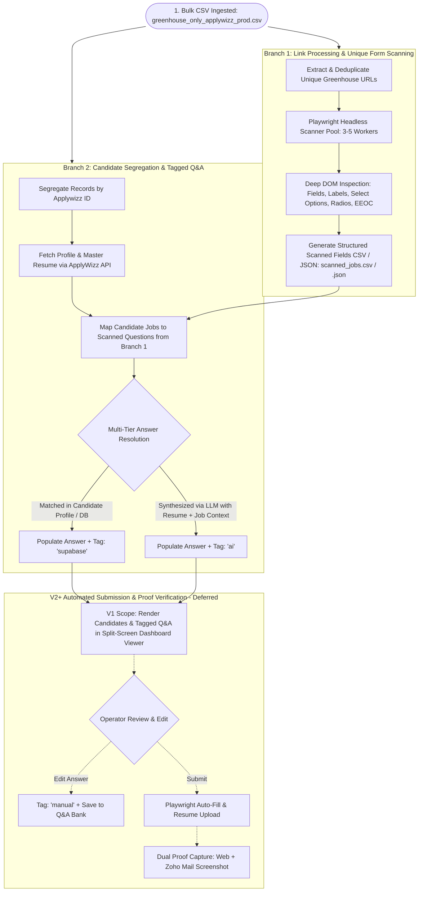

# Codebase Technical Analysis & Living Architecture Map

**Project:** Greenhouse Job Application Automation (V1)  
**Repository:** `yaswanthnaidu-yalla-applywizz/greehouse_apply`  
**Current State:** Greenfield Repository (Phase V1-1: Not Started)  
**Last Updated:** 2026-09-04  

---

## 1. Executive Summary

The **Greenhouse Job Application Automation System (V1)** is an industrial-grade, multi-tenant operator platform designed to eliminate the bottleneck of high-volume job applications on Greenhouse ATS (`boards.greenhouse.io`, `job-boards.greenhouse.io`, `app.greenhouse.io/embed/...`, and `grnh.se/...` shortlinks).

The system implements a decoupled **Two-Branch Pipeline**:
1. **Branch 1 (Unique Link Processing & DOM Scanning):** Deduplicates thousands of job links from an input CSV (`greenhouse_only_applywizz_prod(in).csv`) and employs a parallel headless Playwright worker pool to extract form fields, labels, input types, required flags, and dropdown options *exactly once per unique URL*, persisting results to intermediate JSON/CSV.
2. **Branch 2 (Candidate Segregation & Tagged Answer Resolution):** Segregates rows by candidate `Applywizz ID`, syncs rich candidate profiles and master PDF resumes via the ApplyWizz API, and resolves all application questions using a multi-tier resolution engine with strict source attribution:
   - **`supabase`** for direct/fuzzy matches against candidate profile attributes.
   - **`ai`** for LLM-synthesized responses (Google Gemini / OpenAI) combining profile, resume text, and job description context.

Resolved data is served via an Express REST API to a responsive React Native / Web Split-Screen Operator Dashboard for immediate inspection and queue management.

---

## 2. Repository Structure

```
greehouse_apply/
├── .env.example                               # Environment variable template [Planned]
├── package.json                               # Dependencies, scripts, and build configuration [Planned]
├── tsconfig.json                              # TypeScript strict compiler configuration [Planned]
├── STATE.md                                   # Project state and phase tracking
├── CODEBASE_ANALYSIS.md                       # Living technical architectural map
├── greenhouse_only_applywizz_prod(in).csv      # Sample input ingestion CSV (73.7 KB)
├── project docs/                              # Project technical specifications and requirements
│   ├── 01-prd.md                              # Product Requirements Document
│   ├── 02-trd.md                              # Technical Requirements Document
│   ├── 03-workflow.md                         # Workflow diagrams & execution steps
│   ├── 04-ui-ux.md                            # Split-screen UI/UX design specifications
│   ├── 05-backend-schema.md                   # Data schemas and Supabase migration DDL
│   ├── 06-implementation.md                  # Phased build roadmap and verification checkpoints
│   ├── AGENTS.md                              # Coding conventions, tool rules, and state protocols
│   ├── MASTER_GOAL.md                         # Master Vision document (V1, V2+, V3)
│   └── requirement_interview_for_context_persistence.md # Requirement transcript & context log
├── src/                                       # Core TypeScript application source [Planned]
│   ├── config/
│   │   └── env.ts                             # Environment variable parsing and validation [Planned: ~40 lines]
│   ├── types/
│   │   └── index.ts                           # Domain TypeScript interfaces and types [Planned: ~120 lines]
│   ├── scanner/                               # Branch 1: Playwright link scanning engine [Planned]
│   │   ├── csvDeduplicator.ts                 # Ingestion & URL canonicalization [Planned: ~70 lines]
│   │   ├── playwrightScanner.ts               # Headless worker pool & DOM extractor [Planned: ~220 lines]
│   │   └── exportScannedJobs.ts               # CSV/JSON template serializer [Planned: ~60 lines]
│   ├── candidate/                             # Branch 2: Candidate segregation & sync [Planned]
│   │   ├── applywizzClient.ts                 # ApplyWizz API client & PDF downloader [Planned: ~90 lines]
│   │   └── segregator.ts                      # Candidate row grouper & job mapper [Planned: ~60 lines]
│   ├── resolver/                              # Answer resolution engine [Planned]
│   │   ├── profileMatcher.ts                  # Direct & fuzzy candidate matcher [Planned: ~110 lines]
│   │   ├── llmSynthesizer.ts                  # Gemini / OpenAI prompt synthesizer [Planned: ~130 lines]
│   │   └── answerResolver.ts                  # Multi-tier resolution orchestrator [Planned: ~100 lines]
│   └── server/                                # Backend presentation API [Planned]
│       └── index.ts                           # Express server & queue endpoints [Planned: ~140 lines]
├── dashboard/                                 # Frontend operator viewer [Planned]
│   ├── App.tsx                                # Main split-screen container [Planned: ~120 lines]
│   ├── CandidateList.tsx                      # Left pane: segregated candidates directory [Planned: ~100 lines]
│   ├── JobQueueView.tsx                       # Right pane top: job queue tabs [Planned: ~80 lines]
│   └── FormRenderer.tsx                       # Right pane: tagged Q&A viewer [Planned: ~160 lines]
├── output/                                    # Generated intermediate artifacts [Planned]
│   ├── scanned_jobs.csv                       # Scanned unique form templates (CSV format)
│   └── scanned_jobs.json                      # Scanned unique form templates (JSON format)
└── resumes/                                   # Downloaded candidate master resumes [Planned]
    └── [applywizzId]_resume.pdf               # Candidate-isolated resume PDF binaries
```

---

## 3. Tech Stack

| Layer / Component | Technology | Purpose |
| :--- | :--- | :--- |
| **Runtime & Language** | **Node.js (v20+) / TypeScript (Strict Mode)** | Type-safe async I/O runtime powering pipeline and API. |
| **Browser Automation Engine** | **Playwright (`playwright`)** | Headless Chromium pool for reliable Greenhouse DOM scanning and iframe inspection. |
| **CSV Parsing & Serialization** | **`fast-csv` / `csv-parser`** | Memory-efficient streaming parser and serializer for bulk CSV datasets. |
| **Candidate Details API Client** | **Axios (`axios`)** | HTTP client querying ApplyWizz candidate profile API and streaming resume PDFs. |
| **Fuzzy Matching** | **Fuse.js (`fuse.js`)** | Local fuzzy string matching for candidate profile keys to form labels ($\ge 0.85$ threshold). |
| **AI / LLM Engine** | **Google Gen AI SDK (`@google/genai`) / OpenAI SDK (`openai`)** | Synthesizes answers for open-ended and behavioral application questions. |
| **Backend API Server** | **Express.js (`express`, `cors`)** | Serves candidate queues, scanned job templates, and resolved Q&A to the dashboard. |
| **Frontend Dashboard** | **React Native for Web / React (`react`, `react-dom`)** | Responsive split-screen operator dashboard for queue and form inspection. |
| **Configuration Validation** | **Zod (`zod`) / `dotenv`** | Strict environment variable parsing, validation, and defaults. |

---

## 4. Environment Variables

| Variable | Required | Default | Description |
| :--- | :--- | :--- | :--- |
| `PORT` | Optional | `3000` | Port for the Express backend server. |
| `NODE_ENV` | Optional | `development` | Runtime environment (`development`, `production`, `test`). |
| `GEMINI_API_KEY` | Optional* | — | Google Gemini API key for LLM answer synthesis (*either Gemini or OpenAI key required). |
| `OPENAI_API_KEY` | Optional* | — | OpenAI API key for LLM answer synthesis. |
| `LLM_PROVIDER` | Optional | `gemini` | Preferred LLM provider (`gemini` or `openai`). |
| `SCANNER_CONCURRENCY` | Optional | `4` | Number of parallel Playwright worker pages (range: 3–5). |
| `SCANNER_PAGE_TIMEOUT_MS` | Optional | `30000` | Navigation timeout in milliseconds for Playwright page loads. |
| `SCANNER_JITTER_MIN_MS` | Optional | `3000` | Minimum randomized delay (ms) between consecutive requests to avoid rate limits. |
| `SCANNER_JITTER_MAX_MS` | Optional | `6000` | Maximum randomized delay (ms) between consecutive requests. |
| `APPLYWIZZ_API_BASE_URL` | Optional | `https://www.apply-wizz.me/api` | Base URL for the ApplyWizz client details API. |
| `INPUT_CSV_PATH` | Optional | `./greenhouse_only_applywizz_prod(in).csv` | Default path to the input CSV file. |
| `OUTPUT_DIR` | Optional | `./output` | Directory for intermediate scanned job files. |
| `RESUMES_DIR` | Optional | `./resumes` | Directory for downloaded candidate master resumes. |

---

## 5. Data Flow Summary



---

## 6. Module Deep Dives

### 6.1 `src/config/env.ts`
- **Role:** Loads, parses, and validates runtime environment variables using `dotenv` and `zod`.
- **Exports:** Typed configuration object `config` (API keys, timeouts, worker concurrency, file paths).
- **Invariants:** Throws a descriptive error at startup if required configurations are invalid.

### 6.2 `src/types/index.ts`
- **Role:** Defines the single source of truth for all domain interfaces and types across the system.
- **Key Types:** `ScannedField`, `ScannedJobTemplate`, `ApplyWizzCandidateProfile`, `ResolvedField`, `CandidateJobQueueItem`.
- **Invariants:** Strict TypeScript mode; zero `any` types.

### 6.3 `src/scanner/csvDeduplicator.ts`
- **Role:** Streams the input CSV, strips tracking query parameters (`gh_src`, `utm_*`), normalizes Greenhouse shortlinks (`grnh.se`), and extracts unique job URLs.
- **Inputs:** Path to input CSV.
- **Outputs:** `Promise<string[]>` (array of canonicalized unique Greenhouse URLs).

### 6.4 `src/scanner/playwrightScanner.ts`
- **Role:** Manages a pool of 3–5 headless Playwright worker pages with randomized 3–6s jitter. Inspects DOM structures, detects 404/expired postings, identifies form wrappers (`#application_form`, iframe), and extracts question labels, types, options, and required statuses.
- **Inputs:** Array of unique URLs.
- **Outputs:** `Promise<ScannedJobTemplate[]>`.

### 6.5 `src/scanner/exportScannedJobs.ts`
- **Role:** Serializes scanned job templates into `output/scanned_jobs.json` and `output/scanned_jobs.csv`.
- **Inputs:** `ScannedJobTemplate[]`.
- **Outputs:** File writes to `output/`.

### 6.6 `src/candidate/applywizzClient.ts`
- **Role:** Queries `https://www.apply-wizz.me/api/get-client-details?applywizz_id=...`, parses candidate profile structures, and downloads candidate master resumes to `./resumes/${applywizzId}_resume.pdf`.
- **Inputs:** `applywizzId: string`.
- **Outputs:** `Promise<ApplyWizzCandidateProfile>`.

### 6.7 `src/candidate/segregator.ts`
- **Role:** Reads input CSV, groups job applications by `Applywizz ID`, and produces isolated candidate job batches.
- **Inputs:** Input CSV path.
- **Outputs:** `Map<string, CandidateBatch>`.

### 6.8 `src/resolver/profileMatcher.ts`
- **Role:** Evaluates candidate profile attributes against scanned form fields using keyword mapping and Fuse.js fuzzy matching ($\ge 0.85$).
- **Inputs:** `field: ScannedField`, `profile: ApplyWizzCandidateProfile`.
- **Outputs:** `{ value: string; confidence: number } | null` (assigned `source: "supabase"` if matched).

### 6.9 `src/resolver/llmSynthesizer.ts`
- **Role:** Constructs prompts containing candidate profile, resume excerpt, job description, question label, and select options; calls Gemini/OpenAI SDK to generate high-confidence answers.
- **Inputs:** `field: ScannedField`, `profile: ApplyWizzCandidateProfile`, `jobContext: { title: string; company: string }`.
- **Outputs:** `Promise<{ value: string; confidence: number }>` (assigned `source: "ai"`).

### 6.10 `src/resolver/answerResolver.ts`
- **Role:** Orchestrates the multi-tier resolution process for each candidate and assigned job, combining Branch 1 templates with candidate profiles to produce `CandidateJobQueueItem` records.
- **Inputs:** Scanned job templates, segregated candidates, candidate profiles.
- **Outputs:** `Promise<CandidateJobQueueItem[]>`.

### 6.11 `src/server/index.ts`
- **Role:** Express REST API server providing endpoints:
  - `GET /api/candidates`: List segregated candidates with job counts and status summaries.
  - `GET /api/candidates/:id`: Get candidate profile details and assigned job queue.
  - `GET /api/candidates/:id/jobs/:jobId`: Get resolved job application form with tagged fields.
  - `POST /api/pipeline/run`: Trigger full or partial pipeline execution.

### 6.12 `dashboard/` UI Components
- **`App.tsx`:** Root split-screen layout component coordinating state.
- **`CandidateList.tsx`:** Left pane listing segregated candidates with search, filter, and progress indicators.
- **`JobQueueView.tsx`:** Right pane top tab bar showing jobs for the selected candidate.
- **`FormRenderer.tsx`:** Right pane dynamic form rendering with green `supabase` and purple `ai` badges.

---

## 7. Intermediate File Schemas

### 7.1 Input CSV Schema (`greenhouse_only_applywizz_prod(in).csv`)
| Column | Type | Description | Sample Value |
| :--- | :--- | :--- | :--- |
| `Date` | `string` | Ingestion batch date | `2/9/2026` |
| `Applywizz ID` | `string` | Unique candidate identifier | `AWL-36144` |
| `Client Name` | `string` | Full candidate name | `Sai Palutla` |
| `url` | `string` | Greenhouse job posting URL | `https://job-boards.greenhouse.io/doordashusa/jobs/7990832` |
| `score` | `number` | Candidate job match score | `0` |
| `scored_jobId` | `string` | Internal job reference ID | `1984_4332117` |
| `status` | `string` | Application state in batch | `PENDING` |

### 7.2 Intermediate Scanned Job Template (`output/scanned_jobs.json`)
```typescript
interface ScannedField {
  fieldId: string;
  name: string;
  type: 'text' | 'textarea' | 'select' | 'radio' | 'checkbox' | 'file' | 'location_autocomplete';
  label: string;
  isRequired: boolean;
  options?: string[];
  metadata?: {
    selector?: string;
    section?: string;
  };
}

interface ScannedJobTemplate {
  jobUrl: string;
  companyName: string;
  jobTitle: string;
  fields: ScannedField[];
  scannedAt: string;
  isExpired: boolean;
}
```

### 7.3 Candidate Profile Schema (`ApplyWizzCandidateProfile`)
```typescript
interface ApplyWizzCandidateProfile {
  applywizzId: string;
  clientName: string;
  firstName: string;
  lastName: string;
  email: string;
  phone: string;
  location: string;
  linkedinUrl: string;
  websiteUrl?: string;
  githubUrl?: string;
  workAuthorization: string;
  requiresSponsorship: boolean;
  education: Array<{
    institution: string;
    degree: string;
    fieldOfStudy: string;
    graduationYear: string;
  }>;
  workExperience: Array<{
    company: string;
    title: string;
    startDate: string;
    endDate: string;
    description: string;
  }>;
  resumeUrl: string;
  localResumePath: string;
}
```

### 7.4 Resolved Field & Queue Schema (`CandidateJobQueueItem`)
```typescript
interface ResolvedField {
  fieldId: string;
  name: string;
  type: string;
  label: string;
  value: string;
  source: 'supabase' | 'ai'; // Strict V1 tagging convention
  confidence: number;
}

interface CandidateJobQueueItem {
  applywizzId: string;
  clientName: string;
  jobUrl: string;
  companyName: string;
  jobTitle: string;
  status: 'READY_FOR_REVIEW' | 'EXPIRED' | 'PENDING';
  formFields: ResolvedField[];
}
```

---

## 8. Identified Issues & Observations

| Severity | Issue / Observation | Context | Mitigation / Note |
| :--- | :--- | :--- | :--- |
| *None* | Greenfield project initialized | Fresh repository setup prior to Phase V1-1 | Issues will be logged here as implementation proceeds. |

---

## 9. Dependency Inventory

| Package | Version | Role / Category | Planned Usage |
| :--- | :--- | :--- | :--- |
| `typescript` | `^5.4.0` | Dev Tooling | Strict type checking and compilation. |
| `@types/node` | `^20.0.0` | Dev Tooling | TypeScript definitions for Node.js runtime. |
| `playwright` | `^1.43.0` | Browser Automation | Headless Chromium pool for DOM inspection and scraping. |
| `fast-csv` | `^5.0.0` | Data Processing | Streaming CSV parsing and generation. |
| `axios` | `^1.6.0` | HTTP Client | ApplyWizz API client & binary resume downloader. |
| `fuse.js` | `^7.0.0` | Matching Engine | Fuzzy matching candidate attributes to form question labels. |
| `@google/genai` | `^0.1.1` | LLM Integration | Google Gemini SDK for synthesizing answers to custom questions. |
| `openai` | `^4.33.0` | LLM Integration | OpenAI SDK alternative for LLM answer synthesis. |
| `express` | `^4.19.0` | Web Server | REST API server for candidate queues and form endpoints. |
| `@types/express`| `^4.17.0` | Dev Tooling | TypeScript definitions for Express. |
| `cors` | `^2.8.5` | Web Server | Cross-origin resource sharing middleware for dashboard. |
| `@types/cors` | `^2.8.17` | Dev Tooling | TypeScript definitions for CORS middleware. |
| `dotenv` | `^16.4.0` | Configuration | Loads environment variables from `.env` file. |
| `zod` | `^3.22.0` | Validation | Schema validation for environment and domain objects. |
| `tsx` / `ts-node` | `^4.7.0` | Dev Tooling | Direct TypeScript execution for CLI scripts and worker pool. |

---

## 10. What's Not Yet Built

### V1 Planned Modules (All currently pending Phase V1-1 to V1-6 execution):
- [ ] **Phase V1-1:** `package.json`, `tsconfig.json`, `src/types/index.ts`, `src/config/env.ts`
- [ ] **Phase V1-2:** `src/scanner/csvDeduplicator.ts`, `src/scanner/playwrightScanner.ts`, `src/scanner/exportScannedJobs.ts`
- [ ] **Phase V1-3:** `src/candidate/applywizzClient.ts`, `src/candidate/segregator.ts`
- [ ] **Phase V1-4:** `src/resolver/profileMatcher.ts`, `src/resolver/llmSynthesizer.ts`, `src/resolver/answerResolver.ts`
- [ ] **Phase V1-5:** `src/server/index.ts`, `dashboard/` UI components
- [ ] **Phase V1-6:** End-to-end integration and pipeline verification

### Deferred V2+ Features (Explicitly Out of V1 Scope):
- [ ] Automated form submission engine (`Playwright` auto-fill & submission trigger)
- [ ] Interactive operator inline editing with `'manual'` source tagging
- [ ] Dual proof capture (Greenhouse confirmation page screenshot + Zoho Mail confirmation email screenshot via `zohomailconnector`)
- [ ] CAPTCHA automated solver (CapSolver / 2Captcha for Cloudflare Turnstile / reCAPTCHA)
- [ ] Supabase PostgreSQL database migration, RLS policies, and Supabase Storage buckets (`resumes`, `proofs_web`, `proofs_email`)
- [ ] Residential proxy pool rotation and cloud queue daemon (`SKIP LOCKED`)
