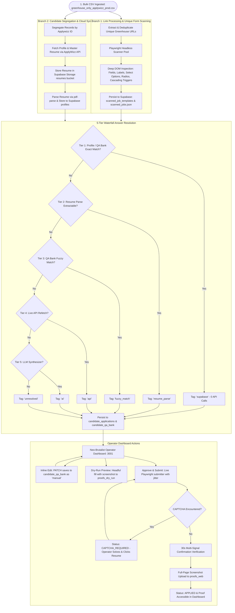

# Master Goal Document: Greenhouse Job Application Automation System

**Project:** Greenhouse Job Application Automation  
**Repository:** `yaswanthnaidu-yalla-applywizz/greehouse_apply`  
**Target ATS:** **Greenhouse Exclusively** (`boards.greenhouse.io`, `job-boards.greenhouse.io`, `app.greenhouse.io/embed/...`, custom company subdomains, and `grnh.se/...` shortlinks)  
**Status:** Authoritative Full-Scope Master Specification (Phase V2 Completed & Production-Ready)  

---

## 1. Executive Summary & Vision

The **Greenhouse Job Application Automation System** is an industrial-grade, multi-tenant operator automation platform built to streamline and automate high-volume job applications on Greenhouse ATS. 

The system solves the labor-intensive bottleneck of applying to hundreds of Greenhouse job openings for diverse candidates by:
1. Ingesting bulk candidate-job mappings from CSV (`greenhouse_only_applywizz_prod(in).csv`).
2. Executing a **Two-Branch Cloud Pipeline**:
   - **Branch 1 (Unique Link Processing & Scanning):** Deduplicating job URLs across all candidates and running a parallel Playwright browser pool to scan form fields, questions, input types, and dropdown options **exactly once per unique URL**, probing conditional options for cascading fields, and persisting to Supabase `scanned_job_templates`.
   - **Branch 2 (Candidate Segregation & Cloud Ingestion):** Segregating rows by candidate `Applywizz ID`, fetching candidate profiles and master resumes from the ApplyWizz API, saving resumes to Supabase Storage `resumes` bucket, parsing structured resume text via `pdf-parse`, and upserting profiles to Supabase `profiles`.
3. Auto-resolving answers with a **5-Tier Waterfall Resolution Engine**:
   - **Tier 1 (`supabase`)**: Candidate profile attributes & exact question fingerprint in `candidate_qa_bank`.
   - **Tier 2 (`resume_parse`)**: Structured resume data extracted from cached PDF resume.
   - **Tier 3 (`fuzzy_match`)**: Fuse.js fuzzy matching against historical QA bank.
   - **Tier 4 (`api`)**: On-demand live ApplyWizz API refetch.
   - **Tier 5 (`ai`)**: LLM-synthesized answers (OpenRouter / Gemini / OpenAI).
4. Providing a responsive **Neo-Brutalist Operator Dashboard (`http://localhost:3001`)** for operators to inspect candidate queues (< 23 questions), edit answers inline (saving to `candidate_qa_bank`), watch headful **Dry-Runs**, launch live automated **Approve & Submit** actions, and inspect **Full-Page Web Proofs**.
5. Executing live submissions with humanized anti-bot jitter, automatic CAPTCHA pause/resumption, multi-signal confirmation verification, and full-page screenshot uploads to Supabase Storage `proofs_web`.

---

## 2. End-to-End System Flowchart



---

## 3. Product Roadmap by Versions & Phases

```
┌──────────────────────────────────────────────────────────────────────────────────────────────────┐
│                                 PRODUCT VERSIONING ROADMAP                                       │
├───────────────────────────────┬──────────────────────────────────┬───────────────────────────────┤
│          VERSION 1            │            VERSION 2             │           VERSION 3           │
│     [STATUS: COMPLETED]       │       [STATUS: COMPLETED]        │       [STATUS: PLANNED]       │
├───────────────────────────────┼──────────────────────────────────┼───────────────────────────────┤
│ • Bulk CSV Stream Ingestion   │ • Supabase Postgres Persistence  │ • Zoho Mail Email Proof       │
│ • Branch 1: Unique URL Scan   │ • 5-Tier Waterfall Resolution    │ • Automated CapSolver Bypass  │
│ • Branch 2: Candidate Segreg. │ • Inline Edit & QA Bank PATCH    │ • Residential Proxy Pool      │
│ • ApplyWizz API Sync & Resume │ • Cascading Field Detection      │ • Background Queue Daemon     │
│ • Tagged Q&A ('supabase'/'ai')│ • Headful Dry-Run (Preview)      │ • Lifting < 23 Question Filter│
│ • Split-Screen Dashboard      │ • Live Submit & Multi-Signal Ver.│ • Multi-Tenant Operator RBAC  │
│ • < 23 Question Filter Gating │ • Full-Page Web Proof in Storage │ • Production Cloud Hosting    │
│ • 6-Checkpoint E2E Test Suite │ • Neo-Brutalist Job Board UI     │ • High-Concurrency Clusters   │
└───────────────────────────────┴──────────────────────────────────┴───────────────────────────────┘
```

### Version 1 (V1) — Ingestion, Scanning, Tagged Q&A & Dashboard Viewer ✅ COMPLETED
- **Status:** **Completed & Verified** (100% test pass rate).
- **Scope & Deliverables:**
  1. Ingestion of `greenhouse_only_applywizz_prod(in).csv`.
  2. Branch 1: URL deduplication, Playwright headless scan of unique links, and generation of `output/scanned_jobs.csv`.
  3. Branch 2: Segregation by `Applywizz ID`, ApplyWizz API candidate sync, master resume PDF download to `./resumes/`.
  4. Multi-tier Answer Resolution with strict tagging (`supabase` vs `ai`).
  5. Split-Screen Operator Dashboard displaying segregated candidate lists and pre-populated forms.
  6. Question count threshold filter (`MAX_JOB_QUESTIONS=23`) to streamline active queues.

### Version 2 (V2) — Cloud Persistence, 5-Tier Waterfall, Live Submissions & Web Proofs ✅ COMPLETED
- **Status:** **Completed, Integrated, and Production-Ready** (135/135 tests passing).
- **Scope & Deliverables:**
  1. **Supabase Cloud Layer:** PostgreSQL database schema (`profiles`, `scanned_job_templates`, `candidate_applications`, `candidate_qa_bank`) and Storage buckets (`resumes`, `proofs_web`, `proofs_dry_run`).
  2. **5-Tier Waterfall Resolution:** Supabase Profile/Exact QA $\rightarrow$ PDF Resume Parser $\rightarrow$ Fuzzy QA Match $\rightarrow$ Live API Refetch $\rightarrow$ LLM Synthesis with write-back caching.
  3. **Inline Review & QA Bank PATCH:** Dashboard inline editing (`PATCH /api/applications/:id/fields/:fieldId`) writing back to `candidate_qa_bank` with `source: 'manual'` for highest priority on future runs.
  4. **Cascading Field Detection:** Probing option values in scanner and dynamic cascade loop in form filler.
  5. **Headful Dry-Run Mode:** Full form auto-fill preview in visible browser with screenshot capture.
  6. **Playwright Live Submissions:** Automated form filling with humanized anti-bot jitter (300–800ms), 30-second multi-signal confirmation verification (Page Title, DOM tokens, URL navigation).
  7. **CAPTCHA Detection & Human Resumption:** Detects Cloudflare Turnstile, reCAPTCHA, hCaptcha, pauses session with `CAPTCHA_REQUIRED` status, and resumes submission with 1 click.
  8. **Full-Page Web Proof Capture:** Captures full-page confirmation screenshot, stores it in Supabase Storage `proofs_web/{appId}_web.png`, and links it in the dashboard.
  9. **Neo-Brutalist Job Board Aesthetic:** Restyled UI (`#FFF5EB` warm cream, crisp dark borders `border border-[#1A1A2E]`, Coral `#E88474` primary CTAs, Soft Blue `#B8D4E8` dry-run buttons, DifficultyBadges, and dedicated Stats tab).
  10. **Unified Master Entrypoint & CLI:** Single-command execution (`npm start`), standalone CLIs (`runScan`, `runCandidateSync`, `runResolver`, `runLiveSubmitCli`), and master test suite (`tests/e2eIntegration.test.ts`).

### Version 3 (V3) — Enterprise Scale, Email Proofs & Autonomous Queues ⏳ PLANNED
- **Objective:** Cloud-native, high-concurrency unattended operation with dual-channel email verification.
- **Scope & Deliverables:**
  1. **Zoho Mail Email Proof Capture:** Searches Zoho Mail via `zohomailconnector` for the confirmation email matching company/job and captures a full email screenshot to complete dual-channel proof.
  2. **Automated CAPTCHA Solving:** Integrated CapSolver / 2Captcha API for automated Turnstile/reCAPTCHA solving without human intervention.
  3. **Residential Proxy Pool:** Integration of rotating residential proxies (Railway/BrightData) to bypass IP rate limits.
  4. **Background Queue Daemon:** Node.js queue worker with `SELECT ... FOR UPDATE SKIP LOCKED` handling 3–8 concurrent worker instances.
  5. **Lifting the `< 23` Question Filter:** Expanding automated processing to all complex and long-form Greenhouse postings.
  6. **Multi-Tenant Operator RBAC:** Role-based access control, audit logs, and team performance analytics.

---

## 4. Tag Source Taxonomy & Resolution Hierarchy

| Source Tag | Definition | Resolution Rule | Examples |
| :--- | :--- | :--- | :--- |
| **`supabase`** | Sourced directly from candidate profile or exact QA bank match. | Match against profile attributes or exact fingerprint in `candidate_qa_bank`. (0 API calls). | First Name, Last Name, Email, Phone, "Are you authorized to work in the US?", LinkedIn URL. |
| **`resume_parse`** | Sourced from parsed candidate master PDF resume text. | `pdf-parse` extraction stored in candidate parsed resume context. | Skills, Education, University Name, GPA, Work Experience summaries. |
| **`fuzzy_match`** | Sourced from historical QA bank via fuzzy question matching. | Fuse.js fuzzy match on question label ($\ge 0.82$ similarity). | "Current notice period in days?", "Willingness to relocate?". |
| **`api`** | Sourced from on-demand live ApplyWizz API refetch. | Triggered only when Tiers 1–3 yield no answer. | Newly updated candidate details or contact attributes. |
| **`ai`** | Synthesized dynamically by an LLM (OpenRouter / Gemini / OpenAI). | Unmapped open-ended custom question $\rightarrow$ LLM prompt with Profile + Resume + Job JD. | "Why do you want to join our engineering team?", "Describe your experience with React Native". |
| **`manual`** | Modified or entered directly by the operator. | Operator edits a field on the dashboard $\rightarrow$ saved to `candidate_qa_bank`. | Operator overrides an answer or corrects a value before submission. |

---

## 5. System Requirements & Operational Constraints

### 5.1 ATS Compatibility Constraints
- **Target ATS:** Exclusively Greenhouse.
- **URL Formats Supported:**
  - Standard job board: `https://job-boards.greenhouse.io/<company>/jobs/<id>`
  - Legacy job board: `https://boards.greenhouse.io/<company>/jobs/<id>`
  - Embed form: `https://app.greenhouse.io/embed/job_app?token=<token>`
  - Shortlink redirects: `https://grnh.se/<token>` (resolved to canonical board before scanning)
  - Custom vanity domains: `https://careers.<company>.com/jobs/<id>` powered by Greenhouse iframe.

### 5.2 Anti-Bot & Rate Limiting Constraints
- **Humanized Interaction Jitter:** 300–800ms randomized delay between individual form field fills.
- **Scanner Jitter:** 3–6 seconds randomized delay between consecutive page loads on the same domain.
- **Retry Mechanism:** 3 retries with exponential backoff on network timeouts or rate limits (HTTP 429).

### 5.3 Candidate Data & Resume Storage Constraints
- **ApplyWizz API:** `https://www.apply-wizz.me/api/get-client-details?applywizz_id=AWL-****`
- **Resume Binary:** Downloaded directly from `resume_url`, stored in Supabase Storage `resumes/{applywizzId}_resume.pdf`.
- **Integrity Guarantee:** Zero cross-candidate data contamination; job applications strictly isolated by `applywizz_id`.
