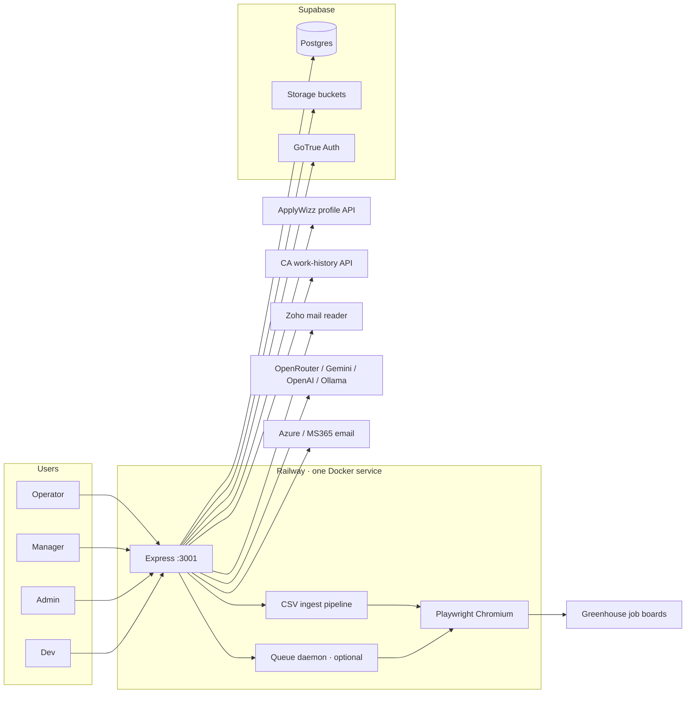
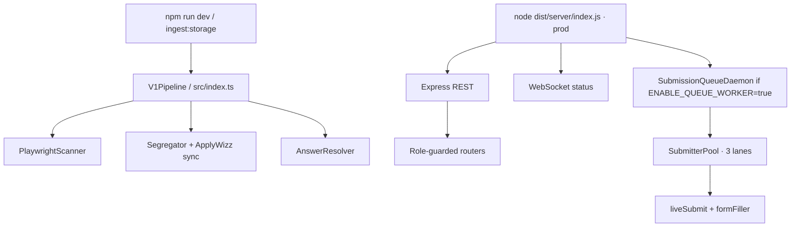
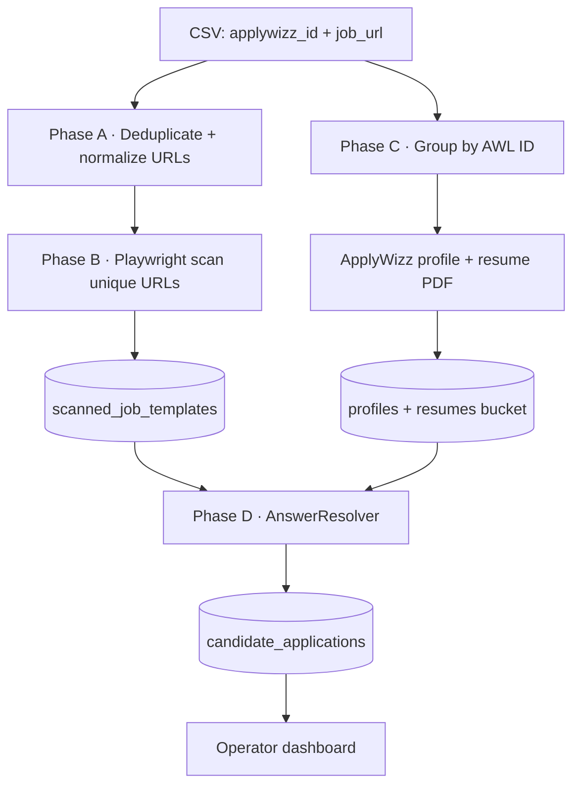
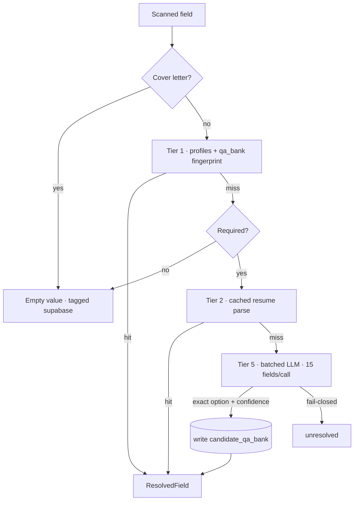
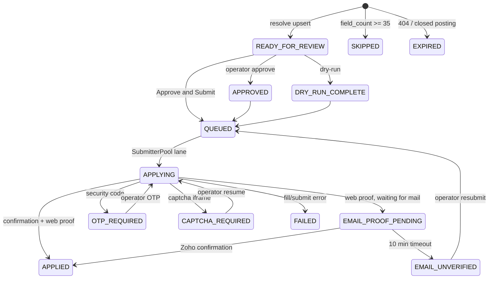
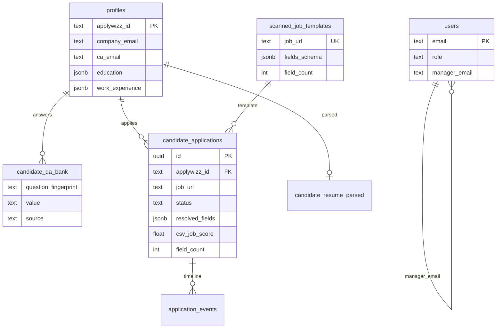
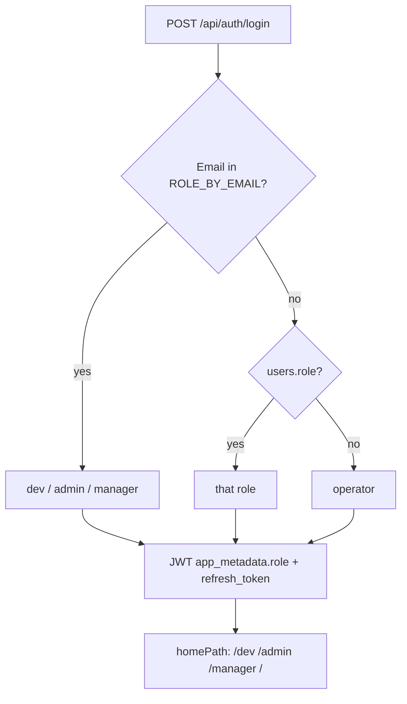
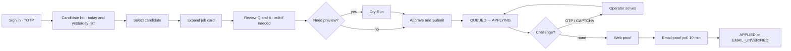
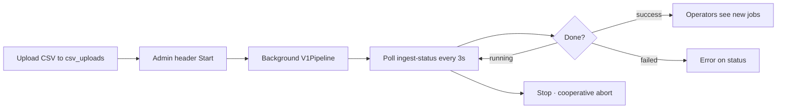
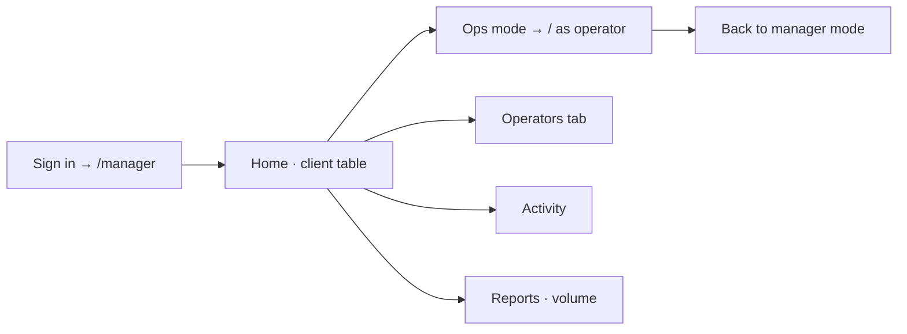

# ApplyWizz Greenhouse Automation — System Overview

Internal bulk job-application platform. Operators ingest a CSV of `applywizz_id` → Greenhouse URL pairs; the system scans forms, resolves per-candidate answers, and submits via Playwright. Four role dashboards provide review, ops, and debugging.

This document is a codebase-level analysis from four perspectives: **Software Architect**, **Software Developer**, **Product Manager**, and **Critique**. It is not a replacement for `.ai/` sprint docs.

| Audience | Start here |
|---|---|
| New engineer | [What this is](#1-what-this-is) → [Architecture](#2-software-architect) → [Repo map](#32-repository-map) |
| Operator / manager | [Product](#4-product-manager) → [User flows](#42-user-flows) |
| Planning next work | [Critique](#5-critique) → [Actionable questions](#6-actionable-insights-and-questions) |

**Production:** [https://gh.applywizz.ai](https://gh.applywizz.ai) · Railway project `alert-spontaneity` · service `greehouse_apply` · region `sfo`

---

## Table of contents

1. [What this is](#1-what-this-is)
2. [Software Architect](#2-software-architect)
3. [Software Developer](#3-software-developer)
4. [Product Manager](#4-product-manager)
5. [Critique](#5-critique)
6. [Actionable insights and questions](#6-actionable-insights-and-questions)
7. [Appendix](#7-appendix)

---

## 1. What this is

### Problem

Manually applying to hundreds of Greenhouse ATS postings per candidate does not scale. Career associates (operators) need a review-gated pipeline that fills forms from a known candidate profile, submits in a real browser, and stores proof.

### Constraints (non-negotiable)

| Constraint | Why it exists |
|---|---|
| **Greenhouse only** | `boards.greenhouse.io`, `job-boards.greenhouse.io`, `app.greenhouse.io`, custom subdomains, `grnh.se` shortlinks |
| **Playwright only** | No Greenhouse API. Fill and submit in Chromium. |
| **Question cap 35** | `MAX_JOB_QUESTIONS=35`. Jobs with ≥ 35 fields become `SKIPPED`. |
| **ApplyWizz identity** | Profiles come from `https://www.apply-wizz.me/api/get-client-details?applywizz_id=AWL-****` |
| **Single Railway service** | One Docker container. Dashboard, ingest, and optional queue worker share one process. |

### Out of scope (explicit)

- CAPTCHA bypass (CapSolver / 2Captcha)
- Multi-tenant RLS on core tables
- Residential proxy pool
- Lifting the 35-question cap without an explicit request
- Other ATS platforms

### Target users

| Role | Home | Job |
|---|---|---|
| **Operator** | `/` | Review Q&A, dry-run, approve & submit, handle OTP |
| **Manager** | `/manager` | Team client table, operators, activity, ops mode |
| **Admin** | `/admin` | Org overview, CSV ingest Start/Stop, audit |
| **Dev** | `/dev` | Health, queue, integrations, submission gate, debugger |

---

## 2. Software Architect

### 2.1 System context

The platform is a **single Node.js process** that talks to five external systems and one Postgres/Storage backend.



**Design choice:** everything shares one process so Railway stays simple. The cost is that a long Playwright ingest run, a live submit, and dashboard traffic compete for the same ~1 GB memory and CPU.

### 2.2 Runtime topology



Production start command (`railway.json`) is **`node dist/server/index.js` only**. There is no separate worker service. If `ENABLE_QUEUE_WORKER` is not `"true"`, `POST /submit` sets `QUEUED` and nothing dequeues it.

### 2.3 Dual-branch ingest pipeline

Ingest is the only path that creates work. A CSV in the `csv_uploads` bucket does **nothing** until Admin clicks **▶ Start** (`POST /api/admin/trigger-ingest-from-storage`).



Rules that shape the architecture:

1. **CSV IDs are approval** to fetch ApplyWizz profiles.
2. **`candidate_applications` is created at resolve time**, not at CSV parse. Empty resolution (no non-empty field) skips upsert. Over-cap jobs upsert as `SKIPPED`.
3. **Idempotent upserts** on `(applywizz_id, job_url)` and `(applywizz_id, question_fingerprint)`.
4. **Cooperative abort** between phases (`pipelineAbort.ts`). Admin **⏹ Stop** works on Railway / dev.
5. **Ingest run state is in-process memory** (`runtimeState.ts`). A Railway restart reports `{running: false}` and kills the pipeline.

### 2.4 Answer resolution — intended vs actual

Docs and comments describe a **5-tier waterfall**. The production ingest path in `answerResolver.ts` is shorter.



| Tier | Module | Used by ingest `AnswerResolver`? | Notes |
|---|---|---|---|
| 1 | `tier1Supabase.ts` | Yes | Profile heuristics + exact fingerprint |
| 2 | `tier2ResumeParse.ts` | Yes | `pdf-parse` once; cache in `candidate_resume_parsed` |
| 3 | `tier3FuzzyMatch.ts` | **No** | Only imported by unused `ResolverWorkerPool` |
| 4 | ApplyWizz refetch | Ingest-time only | Embedded in segregator / `ensureSupabaseProfile` |
| 5 | `tier5LLM.ts` + `llmSynthesizer.ts` | Yes | Fail-closed: option must match exactly; `LLM_MIN_CONFIDENCE` |

**Fingerprint:** `SHA-256(normalize(label)|normalize(type))` → 16-char hex. Never key answers by raw label.

**Learning loop:** Tier 5 and operator edits write `candidate_qa_bank` → next run hits Tier 1 (zero LLM spend).

### 2.5 Submission architecture



**In-flight lock:** `QUEUED`, `APPLYING`, `OTP_REQUIRED`, `CAPTCHA_REQUIRED`, `EMAIL_PROOF_PENDING` mean a worker owns the row. `PATCH /status` will not requeue these. `SubmitterPool.inFlightApplicationIds` is the second guard. There is **no automatic requeue on failure**.

**Fill rules of note:**

- SMS / marketing consent fields → always **No** at fill time (`isConsentSmsMarketingField`).
- Cover letters → never filled or uploaded.
- Greenhouse remix-css / React-Select: type into combobox, click option, never Enter on failure.
- Confirmation: title "Thank you for applying" **or** DOM keywords **or** URL `/confirmation`.

### 2.6 Data model



**Storage buckets:** `resumes`, `proofs_web`, `proofs_dry_run`, `proofs_failed`, `proofs_mail`, `csv_uploads`.

**Migrations on disk:** `001`–`019` plus `latest_supabase_migration.sql`. Schema has drifted: `schema.sql` is a V2 snapshot and does not include later columns (`csv_job_score`, `users`, events, `APPROVED`, etc.). Source of truth is the migration folder + live Supabase.

**RLS posture:**

| Tables | Policy |
|---|---|
| Core (`profiles`, templates, qa_bank, applications) | RLS on, `USING (true)` — app-level isolation only |
| `audit_events`, `application_events` | service_role only (015) |
| `users` | RLS disabled (018) after a service_role-only policy blocked sign-in upserts |

### 2.7 Auth and authorization



- Sessions: **7 days** via refresh token (`POST /api/auth/refresh`).
- Privileged emails are **hardcoded** in `src/server/routes/auth.ts` (`ROLE_BY_EMAIL`).
- Request-time role: email map **wins** over a stale JWT claim (`resolveEffectiveAppRole`).
- Manager team: `users.manager_email` → operator emails → `profiles.ca_email` / work-history union (`MANAGER_TEAM_SCOPE_ENABLED = true`).
- Manager **Ops mode:** `X-View-As: operator` (dev may add `X-View-As-Manager-Email`).
- HTML routes check role when a Bearer token is present; API routes use `requireAuth` + `requireRole`.

**API isolation**

| Prefix | Roles |
|---|---|
| `/api/applications`, `/api/notifications`, `/api/config` | operator + manager-in-ops + dev |
| `/api/admin` | admin + dev |
| `/api/manager` | manager + dev |
| `/api/dev` | dev |
| `/api/candidates` | operator, manager, admin, dev (list scoped by role) |

### 2.8 Scalability assessment

| Dimension | Current | Limit |
|---|---|---|
| Ingest scan | 3–5 Playwright workers, 3–6s jitter | Linear in unique URLs; jitter is intentional anti-bot |
| Resolve | `RESOLVER_WORKER_POOL_SIZE` default 3 (max 5); Tier 5 batches of 15 | LLM latency dominates |
| Submit | Fixed **3 lanes** in `SubmitterPool` | Hard-coded; `WORKER_CONCURRENCY` is logged but pool ignores it |
| Horizontal scale | One Railway replica | In-memory ingest state + paused Playwright OTP sessions cannot shard |
| DB | Indexed on status, applywizz_id, queue order | Core RLS is open; no tenant partition |
| Dashboard | Per-request work-history + application aggregates | Date window default is today+yesterday IST — keeps lists small |

**Bottlenecks that will show first:** Playwright memory during ingest, Zoho UI polling (fixed `waitForTimeout` 5–9s), and the single-process queue.

### 2.9 Patterns that are working

- **Fail-closed LLM** for dropdowns — guessed options do not ship.
- **Fingerprint + qa_bank writeback** — spend on a question once.
- **In-flight status set** — stopped the duplicate-submit bug (same app on 2–3 workers).
- **Credential probe on ingest** — anon keys return empty Storage lists with no error; probing every key made that visible.
- **Cooperative pipeline abort** — Admin can stop a multi-minute Playwright run.

---

## 3. Software Developer

### 3.1 Stack

| Layer | Choice |
|---|---|
| Runtime | Node ≥ 22, TypeScript 5.7, ESM (`"type": "module"`) |
| API | Express 4, `ws` |
| DB / Auth / Files | `@supabase/supabase-js` |
| Browser | Playwright Chromium |
| Resolve | Fuse.js, pdf-parse, OpenAI / Gemini / OpenRouter / Ollama |
| Validation | Zod (`src/config/env.ts`) |
| UI (served) | Inline JSX in `dashboard/public/*.html`, React 18 + Babel **from CDN**, Tailwind CDN |
| UI (unserved) | `dashboard/*.tsx` — typechecked, never bundled |

`package.json` still describes the project as **"Greenhouse Job Application Automation System (V1)"**. Production is V2+.

### 3.2 Repository map

```
src/
  index.ts                 CLI master pipeline (also V1 local-cache fallback)
  config/env.ts            Zod env
  orchestrator/            V1Pipeline + abort flag
  scanner/                 CSV, Playwright scan, Storage ingest
  candidate/               Segregator, ApplyWizz client, profile ensure
  resolver/                Waterfall + LLM
  submitter/               Fill, live submit, dry-run, queue, proofs
  server/                  Express, role dashboards, team scope
  db/                      Clients, upserts, migrations 001–019
  services/                Zoho, Azure email, work-history, manager map
  dashboard/               Shared filters + demo fixtures (server-side)
  utils/                   Logger, resolved-field helpers
dashboard/
  public/                  THE UI THAT RUNS (index/admin/manager/dev.html)
  *.tsx                    Parallel unserved copy
tests/                     16 files, invoked via tsx (no Jest/Vitest)
.ai/                       Project memory for agents
```

### 3.3 Largest files (maintainability heat)

These five files hold most of the operational complexity:

| Lines | File | Role |
|---|---|---|
| ~4200 | `dashboard/public/index.html` | Entire operator UI + auth + guide, inline Babel |
| ~1720 | `src/submitter/liveSubmit.ts` | Live apply, OTP/CAPTCHA pause, confirmation, proofs |
| ~1710 | `src/db/applications.ts` | Lifecycle, queue, DTO, eligibility, operator errors |
| ~1650 | `src/submitter/formFiller.ts` | DOM fill, combobox, cascade, resume upload |
| ~1620 | `src/server/index.ts` | Server boot, candidate APIs, ingest triggers, artifacts |

`auth.ts` (~990 lines) and `llmSynthesizer.ts` (~700) are the next concentration points.

### 3.4 Implementation details worth knowing

**Two pipeline entry points**

- `src/orchestrator/pipeline.ts` (`V1Pipeline`) — what Storage ingest and Admin Start call.
- `src/index.ts` (`main`) — local CLI; still has a **V1 cache fallback** (`cache/profiles` + `output/scanned_jobs.json`) when the CSV is missing.

**Two resolvers**

- `AnswerResolver` — used. Tiers 1 → 2 → batched 5.
- `ResolverWorkerPool` — **never imported** outside its own file. This is the only caller of Tier 3.

**Two dashboards**

- Served: `dashboard/public/index.html` (and sibling HTML files).
- Typechecked only: `dashboard/App.tsx`, `JobQueueView.tsx`, `FormRenderer.tsx`, components.
- `npm run build` / Dockerfile compile `src/` only. Editing `.tsx` does not change production UI.

**Logging**

- All `src/` stdout must go through `createLogger` (`[ISO] [LEVEL] [MODULE] message`).
- `haltWithDevAlert` is for **systemic** ingest failures only (Playwright launch, Supabase down, empty CSV, first LLM provider down). Per-job failures stay `[WARN]`.

**Form fill selector strategy**

Greenhouse boards mix classic inputs and remix-css React-Select. Fill path: native control → searchable `.select__input` / `role="combobox"` → field-scoped option click → optional flyout toggle → verify `.select__single-value`. Success log: `Populated via searchable select input`.

**OTP / email proof**

- OTP: Playwright against Zoho reader UI. Reset filter every lookup. Gate with `isGreenhouseOtpEmail` **before** regex. `extractOtpCode` is unsafe on ungated mail.
- Confirmation: REST `queryZohoConfirmationEmail`, forward window `submitted_at` → +10 min, reject OTP subjects. Poller only runs while status is `EMAIL_PROOF_PENDING`.

**Submission eligibility gate**

When enabled (default): live submit requires CSV score **20–60** and `field_count < 35`. Dev dashboard `/dev` System tab toggles it until process restart (`runtimeState`). Display badge `eligibleForSubmission` is independent of the toggle.

### 3.5 Tests

`npm test` runs **only** `tests/e2eIntegration.test.ts` (custom checkpoint runner, not a framework). Other files are standalone `tsx` scripts.

| File | Intent |
|---|---|
| `e2eIntegration.test.ts` | 7-checkpoint suite; locally 28/32; Tier 1 Email assertion fails |
| `resolverWaterfall.test.ts` | Waterfall units |
| `batchLlmValidation.test.ts` | Fail-closed option alignment |
| `submissionEligibilityGate.test.ts` | Score / field-count gate |
| `searchableSelect.test.ts` | Combobox helpers |
| `dashboardRoleResolution.test.ts` | Email map vs JWT vs `users.role` |
| `operatorManagerMapping.test.ts` | Login manager mapping |
| `applicationsPatch.test.ts` | In-flight PATCH guards |
| `proofLifecycle.test.ts` | Email proof window |
| `candidateQueueFilter.test.ts` | Operator queue filters |
| others | Date range, profile country, error copy, cascading, submissions |

**Gap:** no test runner, no coverage, no CI workflow in-repo. Typecheck is `tsc --noEmit` + `dashboard/tsconfig.json`.

### 3.6 Maintainability verdict

**Strengths**

- Domain types in `src/types/index.ts` are clear.
- DB access is centralized (`src/db/*`) with idempotent upserts.
- Role resolution is extracted and tested (`resolveEffectiveAppRole`, `resolveSignInRoleFromSources`).
- Operator-facing errors go through `operatorErrorMessages.ts`.
- Agent memory (`.ai/`, `AGENTS.md`) is unusually complete for this repo’s size.

**Friction**

- God files (fill / submit / server / operator HTML) make safe edits expensive.
- Parallel HTML vs TSX trees will diverge; comments already warn that **HTML is source of truth**.
- `matchBestOption` in Tier 1 falls through to **`options[0]`** when nothing matches — a silent wrong answer.
- Optional fields are tagged `source: 'supabase'` with empty value, which inflates “resolved from profile” metrics.
- `schema.sql` vs migrations vs live DB are three pictures of the same model.
- Default `JWT_SECRET` and `LLM_PROVIDER=ollama` are local-dev footguns.
- Auth bypass when `NODE_ENV=test`, argv contains `test`, or `x-test-bypass: true`.

---

## 4. Product Manager

### 4.1 Jobs to be done

| User | Job | Success |
|---|---|---|
| Operator | Apply a candidate to many Greenhouse jobs today | Jobs move to `APPLIED` with web (and preferably email) proof |
| Manager | See team volume and failures for today/yesterday | Scoped client table + activity; can jump into Ops mode |
| Admin | Load today’s CSV and know ingest is running | Start/Stop + status; no silent empty-bucket “success” |
| Dev | Diagnose a stuck application | Health, queue snapshot, application debugger, gate toggle |

Business goal: **throughput of verified Greenhouse applications per operator-hour**, with a human still accountable for answers and CAPTCHA/OTP.

### 4.2 User flows

**Operator — happy path**



**Admin — ingest**



**Manager — oversight**



### 4.3 Feature inventory (shipped)

**Pipeline**

- CSV ingest with column aliases (`lead_name`, `company_job_url` / `job_url`)
- URL normalize + `grnh.se` shortlink resolve
- Playwright form scan (text, textarea, select, radio, checkbox, file, location autocomplete)
- Expired / 404 detection
- ApplyWizz profile + resume to Storage
- 5-tier resolver (see architect note: 1/2/5 in the live path)
- Question cap → `SKIPPED`
- Submission score gate 20–60

**Operator workspace**

- Split-screen: candidate list + job cards + form
- Source badges: supabase / ai / manual / unresolved
- Inline edit → `manual` in qa_bank
- Dry-run screenshot
- Approve & Submit (no optimistic `QUEUED` on click)
- OTP / CAPTCHA pause + resume
- View web + email proof
- Blocked-status copy via `error_message`
- In-app guide (dry-run ≠ submit)

**Org dashboards**

- Manager: date + CA filters, expandable proofs, Ops mode, workload
- Admin: overview, managers, operators, applications, audit, System, Start/Stop
- Dev: health (ApplyWizz 400 = reachable), runs, errors, queue, integrations, debugger, gate toggle
- Dev header switcher across all four homes

**Proof & compliance-adjacent**

- Web screenshot on confirmation
- Zoho confirmation email JSON
- `EMAIL_UNVERIFIED` after 10 minutes (resubmittable, not a hard fail)
- `audit_events` + `application_events`
- Sign-up gated by CA emails API + OTP + authenticator MFA

### 4.4 Usability notes

**What works for the business**

- Role homes prevent an operator from opening `/admin`.
- Default date window (today + yesterday IST) matches how CAs talk about “today’s work”.
- Source badges make “did the bot guess this?” visible.
- Skip / ineligible jobs stay on the queue with a reason instead of vanishing.
- Demo candidate `AWL-31428` (Akshitha) is pinned for training and combobox regression.

**Friction operators will feel**

- Dry-run vs submit is easy to confuse; the in-page guide exists because this already happened.
- OTP/CAPTCHA still require a human sitting on the dashboard — throughput dies on challenged boards.
- `EMAIL_UNVERIFIED` looks like failure even though web proof may be valid.
- Eligibility gate (score 20–60) can hide “why can’t I submit?” unless the badge/copy is read.
- Admin System tab still shows a **one-line** ingest state; long Playwright runs feel idle (planned ingest status bar, not shipped).

**Friction managers will feel**

- Team scope depends on `users.manager_email` being set at operator login. A CA who never logged in after migration 017 is invisible.
- Reports tab is volume-only.
- Work-history API is a second source of truth for “who is on my team today”.

### 4.5 Alignment with business goals

| Goal | Fit | Comment |
|---|---|---|
| Scale Greenhouse applies | Strong | Scan once, resolve per candidate, queue submit |
| Human accountability | Strong | Review gate, manual edits, no auto-requeue |
| Proof for clients / QA | Medium-strong | Web proof reliable; email proof depends on Zoho + 10 min window |
| Org visibility | Medium | Role dashboards shipped; metrics still being finished locally |
| Cost control | Medium | LLM last-resort + qa_bank; Playwright minutes dominate infra |
| Multi-tenant safety | Weak | App-level roles only; core RLS is open |

The product is an **internal operations tool**, not a self-serve SaaS. That is the right framing: optimize operator cycle time and proof quality, not public onboarding.

---

## 5. Critique

Findings below are ordered by impact. Each item names the perspective it hurts most.

### 5.1 Dual UI trees — highest ongoing cost

`dashboard/public/index.html` (~4200 lines of CDN-compiled JSX) is production. `dashboard/*.tsx` is a second implementation that typechecks but never ships.

| Perspective | Impact |
|---|---|
| Architect | Two sources of truth for the same product surface |
| Developer | Fixes land in the wrong tree; React 19 in npm vs React 18 on CDN |
| Product | Slow, error-prone UI iteration; no component reuse across four HTML files (Header/EmailProof duplicated) |

**Improve:** pick one. Short term: treat HTML as canonical and stop editing TSX except to keep typecheck green. Medium term: Vite (or similar) bundle of the TSX tree, delete Babel-in-browser.

### 5.2 Single process does too many jobs

Ingest (Playwright pool), live submit (3 Chromium contexts), Zoho reader, and Express share one Railway container.

| Perspective | Impact |
|---|---|
| Architect | No horizontal scale; restart kills ingest; OTP sessions die with the process |
| Developer | `ENABLE_QUEUE_WORKER` must be set or the product silently queues forever |
| Product | Admin Start during peak submit hours will contend with operators |

**Improve:** split **web** vs **ingest/worker** services (same image, different start commands), persist ingest run state in Supabase, and fail the health check if the queue is enabled but the daemon is down.

### 5.3 Resolution path does not match the documented 5-tier story

Tier 3 exists and is unused. `ResolverWorkerPool` is dead. Optional fields skip Tier 2/5 and are labeled `supabase`. Tier 1 `matchBestOption` can return `options[0]`.

| Perspective | Impact |
|---|---|
| Architect | Two engines; telemetry (`tier3Hits`) is mostly fiction on the live path |
| Developer | Engineers will “fix Tier 3” and see no production change |
| Product | Unresolved / wrong dropdowns → more operator edits → less throughput |

**Improve:** either wire Tier 3 into `resolveFieldThroughTier2` **before** Tier 5, or delete / quarantine the dead pool. Stop returning `options[0]`; fail-closed like Tier 5. Tag empty optional fields `unresolved` or `skipped_optional`.

### 5.4 V1 leftovers in a V2+ system

- `src/index.ts` synthesizes segments from `cache/profiles` when CSV is missing.
- `V1Pipeline` name and JSON artifact exports (`scanned_jobs.json`, `resolved_applications.json`) still exist beside Supabase.
- `package.json` description says V1.
- `schema.sql` predates migrations 012–019.

Hard rule in `AGENTS.md`: do not reference V1 patterns. The code still does.

**Improve:** CLI should refuse to run without CSV/Storage; treat local JSON as debug export only; refresh `schema.sql` or drop it in favor of migrations.

### 5.5 Security and tenancy gaps

- Core table RLS is `USING (true)`.
- `users` RLS disabled (018) for pragmatic sign-in upserts.
- `JWT_SECRET` defaults to a public string (legacy; sessions are actually Supabase JWTs — the unused secret is confusing).
- Auth bypass headers (`x-test-bypass`, `x-user-email`) if a test-shaped process leaks into a shared env.
- Privileged roles are a source email list in code — org change requires a deploy.
- Storage policies on `storage.objects` are bucket-wide allow.

Acceptable for a trusted internal tool on a private URL; **not** acceptable if this host is reachable more broadly than the CA org.

### 5.6 External-system fragility

| Dependency | Fragility |
|---|---|
| Zoho reader | Playwright UI + long fixed waits; login is cosmetic; OAuth is server-side per mailbox |
| ApplyWizz API | Profile create blocked historically by missing `country` columns (016) |
| Work-history API | Manager scope and operator assignment depend on it |
| LLM | Default `ollama` fails silently locally; first-call halt is good, later failures are not |
| Greenhouse DOM | Remix vs classic vs iframe; combobox regressions are a recurring product incident |

Email proof and OTP are the most operationally expensive features per line of code. They are also the features that make “APPLIED” believable to the business.

### 5.7 Product gaps vs current sprint

From `.ai/activeContext.md` and this review:

1. **Admin ingest status bar** — planned, not started. Operators/admins cannot see phase (scan vs resolve) without Railway logs.
2. **Admin/manager workload metrics** — implemented locally in places, not fully shipped/verified.
3. **`zoho_connected_profiles`** — migration 011 may be missing in prod (known gotcha).
4. **Resume cache never invalidates** — a replaced PDF keeps old `candidate_resume_parsed`.
5. **E2E Email checkpoint** — resolver vs `company_email` mismatch; dry-run still fills email.
6. **No CSV webhook** — by design, but dropzone + Start is easy to forget.
7. **Guide-only education** for dry-run vs submit — consider disabling Dry-Run unless a query flag, if misuse continues.

### 5.8 Inefficiencies

| Inefficiency | Where |
|---|---|
| Browser compile of 4200-line JSX on every operator page load | CDN Babel |
| Duplicate Header / EmailProof / DevSwitcher in 3 HTML files | Admin/manager/dev |
| Fuse.js constructed per field / per option list | `tier1Supabase.matchBestOption` |
| Artifact cache (`loadArtifacts`) plus Supabase | Server still merges local JSON + demo fixtures |
| Resolver fetches qa_bank then does not use it for Tier 3 | `resolveJobApplication` |
| `SubmitterPool` concurrency logged as configurable, hardcoded to 3 | `queueWorker.ts` |
| Ingest probes every Supabase key every run | Necessary today; simplify once Railway holds one `service_role` JWT |
| `liveSubmit.ts` + `formFiller.ts` + `applications.ts` overlap on status/eligibility | Three places to miss a gate |

### 5.9 What to improve — by perspective

**Architect (next 1–2 quarters)**

1. Split web and worker processes; persist ingest state.
2. Collapse to one resolution engine; restore or retire Tier 3.
3. Plan core-table RLS once `assigned_ca_email` / `users` mapping is trusted.
4. Treat Greenhouse board variants as an anti-corruption layer (scanner + filler share field adapters).

**Developer (next few sprints)**

1. Adopt a real test runner; put `npm test` on CI for unit files (gate, roles, PATCH, eligibility) even if Playwright e2e stays manual.
2. Extract operator HTML into modules or migrate to the TSX tree + bundler.
3. Split `formFiller` (native vs combobox vs file vs cascade) and `liveSubmit` (navigate / fill / challenge / proof).
4. Fail-closed dropdown matching in Tier 1.
5. Delete or wire `ResolverWorkerPool`.

**Product (now)**

1. Ship the ingest status bar (no new backend required).
2. Verify manager team mapping in prod after login.
3. Make eligibility / SKIPPED / EMAIL_UNVERIFIED copy unmistakable.
4. Decide whether Dry-Run stays on the primary button row.
5. Confirm Railway `ENABLE_QUEUE_WORKER=true` and Storage `service_role` JWT — these are product outages when wrong, not “infra nits”.

---

## 6. Actionable insights and questions

Use these to steer the next planning conversation. They are questions, not a committed backlog.

### Architecture

1. Should ingest and submit run in a **second Railway service** (same image, `daemon:prod` / `ingest:storage`) so a scan cannot starve the dashboard?
2. Where should **ingest run history** live if the process dies — `audit_events`, a new `ingest_runs` table, or Railway logs only?
3. Is **Tier 3 fuzzy match** worth wiring, or has qa_bank exact fingerprint + batched LLM made it obsolete?
4. When do we enable **RLS that is not `USING (true)`** on `candidate_applications` — after `assigned_ca_email` is 100% populated?

### Product

5. What is the **target applies per operator per day**, and which status (`EMAIL_UNVERIFIED` vs `APPLIED`) counts?
6. Should jobs outside score 20–60 be **hidden**, shown-but-blocked (current), or shown with a manager override?
7. Is the 10-minute email-proof window aligned with how Greenhouse actually sends mail, or do we systematically under-count proofs?
8. Do managers need **assignment** (`PATCH /api/manager/applications/:id/assignment`) as a daily tool, or is work-history enough?
9. Should **Dry-Run** remain a first-class button or become a Dev-only action?

### Engineering quality

10. What is the migration policy — `npm run db:migrate`, SQL Editor only, or both? Several comments say “apply in SQL Editor”.
11. Will we **delete the dashboard `.tsx` tree** or invest in a bundler this quarter?
12. Who owns the **hardcoded privileged email list**, and what happens when someone leaves ApplyWizz?
13. Should `npm test` become a suite runner, and should Railway/PR CI run the non-Playwright tests?

### Operational readiness

14. Is `ENABLE_QUEUE_WORKER=true` set in Railway today? If not, Approve & Submit is a no-op.
15. Does ingest `Probe` log show a `service_role` JWT that can `list` `csv_uploads`? Empty list with no error is a known false “no CSV”.
16. Is migration **011** (`zoho_connected_profiles`) applied? Connected-mailbox filtering depends on it.
17. After resume replacement in ApplyWizz, who **invalidates** `candidate_resume_parsed`?

---

## 7. Appendix

### 7.1 Commands

```bash
npm run dashboard          # Express only (prod-like)
npm run ingest:storage     # One-shot Storage CSV pipeline
npm run scan               # Playwright templates
npm run sync:candidates    # ApplyWizz profiles
npm run resolve            # Waterfall
npm run daemon             # Queue worker standalone
npm run dry-run            # Headful CLI demo (not dashboard API)
npm run typecheck          # src + dashboard TSX
npm test                   # e2eIntegration only
```

Prod: `node dist/server/index.js` (`railway.json`). Health: `GET /api/health`.

### 7.2 Environment (minimum)

Required for a real run: `SUPABASE_URL`, a **Storage-capable `service_role` JWT** (`SUPABASE_SERVICE_ROLE_KEY` / `SUPABASE_SERVICE_KEY`), `APPLYWIZZ_API_URL`, and an LLM key matching `LLM_PROVIDER`.

Critical flags:

| Variable | Effect |
|---|---|
| `RAILWAY_ENV=true` | No headful Playwright; memory cap; ingest stop enabled |
| `ENABLE_QUEUE_WORKER=true` | In-process submit daemon |
| `MAX_JOB_QUESTIONS=35` | Skip / gate threshold |
| `SUBMISSION_ELIGIBILITY_GATE_ENABLED` | Boot default; `/dev` can override until restart |
| `RESOLVER_WORKER_POOL_SIZE` | Parallel resolve (1–5) |
| `WORKER_POOL_SIZE` | Scan concurrency (1–10) |

Full list: `.ai/techContext.md` and `src/config/env.ts`.

### 7.3 HTTP surface (condensed)

| Area | Endpoints |
|---|---|
| Auth | `/api/auth/login`, `refresh`, `logout`, `me`, signup OTP/MFA |
| Operator | `/api/candidates`, `/jobs`, `/api/applications` (fields, status, approve, dry-run, submit, OTP, proofs) |
| Admin | `trigger-ingest-from-storage`, `stop-ingest`, `ingest-status`, `supabase-storage-health`, `/api/admin/*` |
| Manager | `/api/manager/dashboard`, `operators`, `activity`, `reports`, assignment PATCH |
| Dev | `/api/dev/health`, `runs`, `errors`, `queue`, `integrations`, `applications/:id`, `submission-gate` |

### 7.4 Related docs

| File | Use |
|---|---|
| `.ai/projectbrief.md` | Scope, users, constraints |
| `.ai/systemPatterns.md` | Pipeline rules, schema, submission gotchas |
| `.ai/techContext.md` | Commands, env, deploy, MCP ops |
| `.ai/activeContext.md` | Current sprint |
| `.ai/progress.md` | Shipped vs pending vs known bugs |
| `AGENTS.md` | Rules for AI (and humans) working here |
| `README.md` | Stub — this overview is the map |

### 7.5 Status legend (operator-facing)

| Status | Meaning |
|---|---|
| `READY_FOR_REVIEW` | Resolved; waiting on operator |
| `APPROVED` | Explicit approve, not yet queued |
| `DRY_RUN_COMPLETE` | Filled in browser, not submitted |
| `QUEUED` / `APPLYING` | Worker owns it |
| `OTP_REQUIRED` / `CAPTCHA_REQUIRED` / `CAPTCHA_TIMEOUT` | Human needed |
| `EMAIL_PROOF_PENDING` | Web proof taken; waiting for mail |
| `APPLIED` | Confirmed |
| `EMAIL_UNVERIFIED` | 10 min, no matching mail; web proof kept |
| `FAILED` | Submit error |
| `EXPIRED` | Job gone |
| `SKIPPED` | Over question cap |

---

*Generated from a full-repo review of `greehouse_apply` (V2+ on Railway). Sprint facts aligned with `.ai/activeContext.md` as of 2026-09-17. Re-read `.ai/` files before treating any “current focus” line as still true.*
