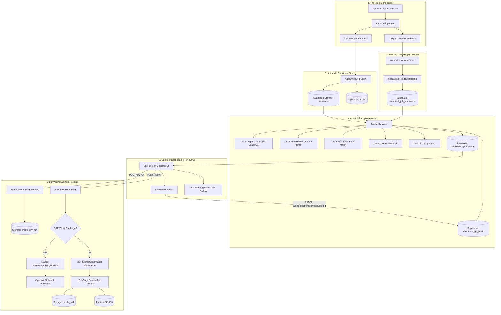

# 🌿 Greenhouse Automated Job Application System (V2)

A robust, enterprise-grade AI-powered platform for automated Greenhouse job application form discovery, 5-tier waterfall answer resolution, operator-reviewed inline editing, dry-run browser verification, live submission with CAPTCHA detection, and cryptographic full-page proof capture.

---

## 🏗️ System Architecture & Workflow



---

## ⚡ Quick Start & CLI Commands

### 1. Database Migration & Provisioning
Migrates local V1 cache data and provisions required Supabase tables and storage buckets:
```bash
npm run db:migrate
```
*Expected Output:*
```text
📦 Ensuring Supabase Storage buckets exist...
✅ Storage buckets (resumes, proofs_web, proofs_dry_run) verified.
🔄 Migrating V1 candidate profiles and job templates...
✅ Migration completed: 50 profiles, 120 templates synced.
```

---

### 2. Branch 1: Scan Greenhouse Job Postings
Extracts form fields, dropdown/radio options, and cascading conditional elements:
```bash
npm run scan
```
*Expected Output:*
```text
🚀 Launching scanner pool: 4 workers for unique URLs...
🔗 Detected cascading field "Are you Hispanic/Latino?" -> "Race"
✅ [25 fields] PMG — AI & Software Engineering Manager
🏁 Finished scanning URLs. Upserted to scanned_job_templates.
```

---

### 3. Branch 2: Sync Candidates & Upload Resumes
Fetches candidate profiles from ApplyWizz API and uploads master PDF resumes to Supabase Storage:
```bash
npm run sync:candidates
```
*Expected Output:*
```text
📥 Syncing 35 candidates from CSV...
✅ AWL-11 (Yaswanth Naidu) synced -> Uploaded resumes/AWL-11_resume.pdf
✅ 35 candidate profiles upserted to profiles table.
```

---

### 4. 5-Tier Waterfall Answer Resolution
Resolves form questions through the 5-tier waterfall with detailed telemetry:
```bash
npm run resolve -- --verbose
```
*Expected Output:*
```text
================================================================
  Answer Resolution Completed Successfully (5-Tier Telemetry)
================================================================
• Elapsed Time:           2.4s
• Applications Ready:     35
• Total Fields Populated: 875
  - 🟢 Tier 1 (Supabase/Exact): 742 (84.8%)
  - 🔵 Tier 2 (Resume Parse):   48 (5.5%)
  - 🔷 Tier 3 (Fuzzy QA Match): 32 (3.7%)
  - 🟣 Tier 4 (API Live Refetch): 18 (2.1%)
  - 🟣 Tier 5 (LLM Synthesis):  35 (4.0%)
================================================================
```

---

### 5. Launch Operator Review Dashboard
Starts the Express REST API and split-screen web application on port 3001:
```bash
npm run start:dashboard
# or npm start
```
*Open http://localhost:3001 in your browser.*

---

### 6. Dry-Run Form Filling (Visual Preview)
Launches Chromium in visible mode to inspect form filling without clicking submit:
```bash
npm run dry-run
```
*Expected Output:*
```text
🌐 Launching Chromium browser in visible (headful) mode...
📝 Starting automated form filling with human jitter (300ms - 800ms)...
[Form Filler] 🏁 Finished filling form: 25/25 successful, 0 failed.
📸 Capturing dry-run screenshot -> Uploaded to proofs_dry_run.
```

---

### 7. Live Automated Form Submission
Submits an application with CAPTCHA detection and multi-signal confirmation verification:
```bash
npm run submit -- --applicationId=<uuid>
```
*Expected Output:*
```text
🚀 Initiating live submission for application <uuid>...
🖱️ Clicking submit button...
🎉 Submission verified! Signal: document.title matches "Thank you for applying"
📸 Proof screenshot saved: https://.../storage/v1/object/public/proofs_web/proofs/<uuid>_web.png
```

---

## 🧪 Running the Verification Test Suites

Execute all automated verification test suites:

```bash
# Run Master End-to-End Integration Suite (7 Checkpoints)
npm run test:e2e

# Run Individual Phase Test Suites
npx tsx tests/proofLifecycle.test.ts
npx tsx tests/cascading.test.ts
npx tsx tests/submissions.test.ts
npx tsx tests/resolverWaterfall.test.ts
npx tsx tests/applicationsPatch.test.ts

# Run TypeScript Type Checker
npm run typecheck
```

---

## 🛡️ Key Features & Guarantees

- **Zero Duplicate API Calls**: Subsequent resolution runs reuse cached Supabase profiles, parsed resumes, and Q&A answers.
- **LLM Cost Efficiency**: LLM synthesis (Tier 5) is only invoked for truly unmapped questions, immediately writing back to `candidate_qa_bank`.
- **Manual Priority Override**: Inline edits from the operator dashboard are tagged `source: 'manual'` and prioritized at Tier 1 in all future applications.
- **Anti-Bot Protections**: Realistic human jitter (300ms–800ms), smooth focus and typing, and synthetic React change events.
- **Auditable Visual Proofs**: Cryptographically stored full-page screenshots for every submitted application with capture timestamp and metadata.
