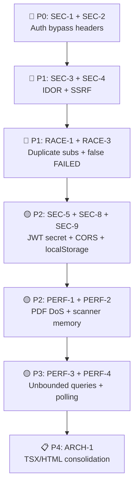

# ApplyWizz — Comprehensive Code Review Report

_Reviewed: 2026-09-21 | Scope: Full codebase (~50+ files) | Reviewers: 5 parallel agents_

---

## Executive Summary

The codebase has a solid pipeline architecture and generally clean separation of concerns. However, the review uncovered **2 showstopper security vulnerabilities** that allow complete auth bypass in production, several race conditions that can cause duplicate submissions, and systemic patterns around unbounded queries and resource leaks that will degrade under scale.

| Severity | Count | Impact |
|---|---|---|
| 🔴 Critical — Must fix | 12 | Auth bypass, data exposure, resource exhaustion, duplicate submissions |
| 🟡 Suggestion — Should improve | 10 | Performance, reliability, maintainability |
| ✅ Good Practices | 8 | Positive patterns worth preserving |

---

## 🔴 Critical Issues — Must Fix

### SEC-1. Auth Guard Bypass via `x-test-bypass` Header ⚠️ SHOWSTOPPER
- **File:** [requireRole.ts](file:///C:/Users/yaswa/Dev/greehouse_apply/src/server/routes/requireRole.ts) (L18-25)
- **Impact:** Any unauthenticated user can bypass ALL role checks in production by sending `x-test-bypass: true`
- **Problem:** `authGuardBypassed()` checks the header unconditionally — it is not gated on `NODE_ENV === 'test'`
- **Fix:**
```typescript
function authGuardBypassed(req: AuthenticatedRequest): boolean {
  return (
    !isSupabaseConfigured() ||
    (process.env.NODE_ENV === 'test' && req.headers['x-test-bypass'] === 'true')
  );
}
```

### SEC-2. Role Escalation via `x-user-role` Header ⚠️ SHOWSTOPPER
- **File:** [requireRole.ts](file:///C:/Users/yaswa/Dev/greehouse_apply/src/server/routes/requireRole.ts) (L107-111)
- **Impact:** If a JWT lacks an email claim, the server reads `x-user-role` from the request header and trusts it — any user can escalate to `dev` or `admin`
- **Fix:** Remove the header fallback entirely. Default to `'operator'` when email is missing:
```typescript
if (email) {
  return resolveEffectiveAppRole(email, jwtRole);
}
return normalizeAppRole(jwtRole) || 'operator';
```

### SEC-3. Missing Authorization on Application Mutations
- **File:** [applications.ts](file:///C:/Users/yaswa/Dev/greehouse_apply/src/server/routes/applications.ts) (L71, L210, L409, L648)
- **Impact:** Any authenticated operator can view/modify ANY application by guessing IDs
- **Problem:** `PATCH /:id/fields/:fieldId`, `PATCH /:id/status`, `POST /:id/approve` never verify `assigned_ca_email` matches the requester
- **Fix:** Add ownership check:
```typescript
if (!adminBypass && application.assigned_ca_email !== userEmail) {
  return res.status(403).json({ error: 'Access denied' });
}
```

### SEC-4. SSRF via Playwright `page.goto()`
- **File:** [submissions.ts](file:///C:/Users/yaswa/Dev/greehouse_apply/src/server/routes/submissions.ts) (L383-388)
- **Impact:** `/:id/open-captcha-session` navigates Playwright to `application.job_url` or `req.body.jobUrl` — a crafted URL like `http://169.254.169.254` or `file:///etc/passwd` exposes internal infrastructure
- **Fix:** Validate URL starts with `https://boards.greenhouse.io/` or known Greenhouse domains

### SEC-5. Hardcoded Default JWT Secret
- **File:** [env.ts](file:///C:/Users/yaswa/Dev/greehouse_apply/src/config/env.ts) (L88)
- **Impact:** If `JWT_SECRET` is unset in production, a universally known default is used
- **Fix:** Remove `.default(...)` — force the server to crash on boot if missing

### SEC-6. XSS via `dangerouslySetInnerHTML` for QR Code
- **Files:** [AuthView.tsx](file:///C:/Users/yaswa/Dev/greehouse_apply/dashboard/components/AuthView.tsx) (L376), [index.html](file:///C:/Users/yaswa/Dev/greehouse_apply/dashboard/public/index.html) (L356)
- **Impact:** If backend is compromised, MFA QR SVG can execute arbitrary JS
- **Fix:** Use DOMPurify to sanitize, or render QR via a client-side library from raw data

### SEC-7. LLM Prompt Injection via Resume Content
- **File:** [llmSynthesizer.ts](file:///C:/Users/yaswa/Dev/greehouse_apply/src/resolver/llmSynthesizer.ts) (L641-645, L786-791)
- **Impact:** Malicious text in a PDF resume is interpolated directly into LLM prompts — attacker can hijack model output
- **Fix:** Use explicit XML delimiters around user content:
```typescript
const prompt = `...
<candidate_resume>
${resumeText.slice(0, 12000)}
</candidate_resume>
...`;
```

### RACE-1. Duplicate Submissions (Queue Worker TOCTOU)
- **File:** [applications.ts](file:///C:/Users/yaswa/Dev/greehouse_apply/src/db/applications.ts) (L1905-1918)
- **Impact:** `getNextQueuedApplicationForRoundRobin` fallback updates `QUEUED → APPLYING` but only checks `!updateRes.error`. If another worker already claimed the row, the update affects 0 rows (no error) — both workers proceed
- **Fix:** Use `.select('id')` and verify `updateRes.data.length > 0`

### RACE-2. Read-Modify-Write on `resolved_fields`
- **File:** [applications.ts](file:///C:/Users/yaswa/Dev/greehouse_apply/src/server/routes/applications.ts) (L116-168)
- **Impact:** `PATCH /:id/fields/:fieldId` reads the full JSONB array, modifies one element, writes it all back — concurrent edits on different fields of the same application silently overwrite each other
- **Fix:** Use PostgreSQL `jsonb_set` for atomic partial updates, or add optimistic concurrency via a version column

### RACE-3. Successful Submission Marked FAILED on Proof Capture Error
- **File:** [liveSubmit.ts](file:///C:/Users/yaswa/Dev/greehouse_apply/src/submitter/liveSubmit.ts) (L1720-1722)
- **Impact:** If `captureWebProof` throws (page crash during screenshot), the outer catch marks the application `FAILED` even though the form was already submitted
- **Fix:** Isolate proof capture in its own try/catch:
```typescript
let proofResult: any = {};
try {
  proofResult = await captureWebProof(page, application);
} catch (err) {
  log.warn(`Proof capture failed after submit: ${err.message}`);
}
// Proceed to mark APPLIED
```

### PERF-1. PDF Parsing DoS
- **File:** [tier2ResumeParse.ts](file:///C:/Users/yaswa/Dev/greehouse_apply/src/resolver/tier2ResumeParse.ts) (L186-188)
- **Impact:** `fs.readFileSync(tempPath)` reads entire PDF into memory without size check — a PDF bomb crashes the process
- **Fix:** Add `fs.statSync()` guard:
```typescript
const stats = fs.statSync(tempPath);
if (stats.size > 5 * 1024 * 1024) throw new Error('PDF exceeds 5MB limit');
```

### PERF-2. Playwright Scanner Memory Leak
- **File:** [playwrightScanner.ts](file:///C:/Users/yaswa/Dev/greehouse_apply/src/scanner/playwrightScanner.ts) (L269-319)
- **Impact:** A single `Page` is reused for hundreds of navigations — Chromium renderer accumulates DOM memory indefinitely
- **Fix:** Create and close a fresh page per URL inside the worker loop

---

## 🟡 Suggestions — Should Improve

### PERF-3. Unbounded Database Queries
- **Files:** [manager.ts](file:///C:/Users/yaswa/Dev/greehouse_apply/src/server/routes/manager.ts) (L337, L592, L713), [devDashboard.ts](file:///C:/Users/yaswa/Dev/greehouse_apply/src/server/routes/devDashboard.ts) (L169-178)
- **Problem:** Multiple endpoints call `listApplications()` without filters, loading the entire `gh_candidate_applications` table into memory for in-memory `.filter()`. This will OOM as data grows.
- **Fix:** Push date/status filters into the database queries; use Supabase RPCs or views for aggregations

### PERF-4. Redundant 3-Second Polling Alongside WebSockets
- **Files:** [App.tsx](file:///C:/Users/yaswa/Dev/greehouse_apply/dashboard/App.tsx) (L332-339, L468-541), [operator-app.jsx](file:///C:/Users/yaswa/Dev/greehouse_apply/dashboard/public/operator-app.jsx) (L3145, L3156)
- **Problem:** The dashboard maintains a WebSocket connection AND a 3-second `setInterval` poll. This doubles network traffic and re-renders.
- **Fix:** Use WebSocket as primary; fall back to slow polling (30-60s) only when WS disconnects

### PERF-5. Unbounded Embedding Cache
- **File:** [semanticSearch.ts](file:///C:/Users/yaswa/Dev/greehouse_apply/src/resolver/semanticSearch.ts) (L12)
- **Problem:** `embeddingCache` is a plain `Map` with no TTL or max size — grows indefinitely in long-running processes
- **Fix:** Replace with `lru-cache` (e.g., `new LRUCache({ max: 5000 })`)

### SEC-8. CORS Allows All Origins
- **File:** [index.ts](file:///C:/Users/yaswa/Dev/greehouse_apply/src/server/index.ts) (L557-568)
- **Problem:** CORS defaults to `*` — any third-party site can interact with the API if they obtain a token
- **Fix:** Set `origin: process.env.ALLOWED_ORIGINS?.split(',')` or use explicit whitelist

### SEC-9. Tokens in localStorage (XSS-Exfiltrable)
- **File:** [roleAccess.js](file:///C:/Users/yaswa/Dev/greehouse_apply/dashboard/public/roleAccess.js) (L87-89)
- **Problem:** JWT access and refresh tokens stored in `localStorage` — any XSS steals the session
- **Fix:** Transition to `HttpOnly`, `Secure`, `SameSite` cookies

### SEC-10. Missing Content Security Policy
- **Files:** All HTML shells (`index.html`, `manager.html`, `admin.html`, `dev.html`)
- **Problem:** No CSP headers or meta tags — no XSS mitigation layer
- **Fix:** Add `<meta http-equiv="Content-Security-Policy" content="...">` with strict directives

### RELIABILITY-1. Paused Playwright Sessions Leak Memory
- **Files:** [captchaResume.ts](file:///C:/Users/yaswa/Dev/greehouse_apply/src/submitter/captchaResume.ts) (L28-30), [liveSubmit.ts](file:///C:/Users/yaswa/Dev/greehouse_apply/src/submitter/liveSubmit.ts) (L1899-1904)
- **Problem:** CAPTCHA/OTP paused sessions have no TTL — if operator ignores them, browsers leak indefinitely
- **Fix:** Add a `setTimeout` cleanup (e.g., 30 minutes) that forcibly calls `closeSubmissionSession`

### RELIABILITY-2. Error Swallowing in Tier 5 LLM
- **File:** [tier5LLM.ts](file:///C:/Users/yaswa/Dev/greehouse_apply/src/resolver/tier5LLM.ts) (L143-145, L275-277)
- **Problem:** API timeouts/rate limits are silently swallowed — fields appear unresolved with no signal that the LLM was unreachable
- **Fix:** Distinguish retriable failures (timeout/5xx) from permanent ones; expose failure mode to the orchestrator

### QUALITY-1. Error Info Leakage in 500 Responses
- **Files:** [applications.ts](file:///C:/Users/yaswa/Dev/greehouse_apply/src/server/routes/applications.ts) (L201, L401, L473), [submissions.ts](file:///C:/Users/yaswa/Dev/greehouse_apply/src/server/routes/submissions.ts)
- **Problem:** Raw `err.message` returned in 500 responses can leak DB schema or internal paths
- **Fix:** Log full error internally, return generic message to client

---

## ✅ Good Practices

| Practice | Where | Notes |
|---|---|---|
| **Idempotent upserts** | `applications.ts`, `profiles.ts` | Pipeline is re-runnable without duplicates |
| **In-flight submission guards** | `submitterPool.ts`, `applications.ts` | `IN_FLIGHT_STATUSES` + `inFlightApplicationIds` prevent most duplicate submissions |
| **Tier waterfall short-circuiting** | `answerResolver.ts` | Non-mandatory fields skip expensive Tier 2/5 operations |
| **Header sanitization** | `httpHeaders.ts` | Proactive defense against HTTP response splitting |
| **Separation of concerns** | Server routes → `submitter/` modules | Playwright code stays out of Express route handlers |
| **DOM fallback hierarchies** | `formFiller.ts` | Robust multi-selector combobox resolution |
| **Graceful degradation** | `applications.ts` | Local caching fallback when Supabase is unreachable |
| **Fail-closed Tier 5** | `llmSynthesizer.ts` | LLM option mismatch or low confidence → `unresolved`, never a guess |

---

## Architecture Concerns (Systemic)

### ARCH-1. Massive Code Duplication Between HTML and TSX
- `operator-app.jsx` (4253 lines) contains **all** operator UI logic in a single file
- `App.tsx` is a parallel TypeScript copy that can drift
- `AuthView.tsx` is copy-pasted into `index.html`
- `useSession.ts` duplicates `roleAccess.js`

> **Risk:** Bugs fixed in one copy will not be fixed in the other. Divergence is already visible.

### ARCH-2. Client-Side-Only Role Enforcement
- Role is read from `localStorage` — any user can change it via DevTools
- Server guards exist but don't verify application **ownership**
- All HTML pages are served without server-side role checks on the document itself

### ARCH-3. In-Memory Runtime State
- Ingest run status lives in `runtimeState.ts` — lost on Railway restart
- Paused submission sessions have no persistent record
- Embedding cache is unbounded and ephemeral

---

## Recommended Priority Order



> [!CAUTION]
> **SEC-1 and SEC-2 are exploitable in production right now.** An attacker can gain full admin access by sending a single HTTP header. Fix these before any other work.
