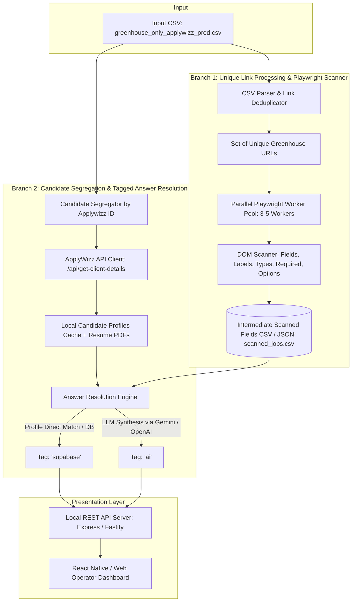

# TRD — Greenhouse Job Application Automation V1

## 1. System Architecture Overview

The V1 system executes a dual-branch pipeline that decouples Greenhouse form scraping from candidate answer resolution.



---

## 2. Technology Stack

| Layer / Component | Technology | Rationale |
| :--- | :--- | :--- |
| **Runtime & Language** | **Node.js (v20+) / TypeScript** | Type safety, high async I/O performance, native Playwright support. |
| **DOM Automation Engine** | **Playwright** (`playwright`) | Reliable headless browser automation, deep iframe support, robust selector evaluation. |
| **CSV Engine** | **csv-parser / fast-csv** | High-speed streaming CSV parsing and generation for large files. |
| **Candidate Details API** | **ApplyWizz API (Axios)** | `https://www.apply-wizz.me/api/get-client-details?applywizz_id=AWL-****` |
| **Fuzzy Matching** | **Fuse.js** | Fast local fuzzy matching against candidate profile keys and historical answers. |
| **AI / LLM Engine** | **Google Gemini SDK (`@google/genai`) or OpenAI SDK** | Generates dynamic responses for custom behavioral and experience questions. |
| **Backend API** | **Express.js / TypeScript** | Serves segregated candidate queues, job details, and scanned Q&A to the dashboard. |
| **Frontend Dashboard** | **React Native (Expo / React Native for Web)** | Responsive split-screen desktop & mobile web operator dashboard. |

---

## 3. Component Specifications

### 3.1 CSV Parser & Link Deduplicator (`src/scanner/csvDeduplicator.ts`)
- **Inputs:** `greenhouse_only_applywizz_prod(in).csv`.
- **Logic:**
  1. Stream-parses CSV rows.
  2. Cleans tracking query parameters (e.g. `gh_src`, `utm_*`).
  3. Resolves shortlinks (`grnh.se/*`) to canonical URLs when possible.
  4. Returns a deduplicated array of unique Greenhouse URLs.

### 3.2 Playwright Unique Form Scanner (`src/scanner/playwrightScanner.ts`)
- **Concurrency:** Configurable worker pool (3–5 workers).
- **Navigation & Detection:**
  - Navigates to each unique URL with standard timeouts (30s).
  - Checks for 404 / closed posting indicators.
  - Detects form container (`#application_form`, `#app_form`, or iframe embed).
- **DOM Field Extraction:**
  - Standard fields: `first_name`, `last_name`, `email`, `phone`, `resume`, `linkedin`, `website`, `location`.
  - Custom fields: Reads `<div class="field">`, input tags (`type="text"`, `textarea`), `<select>` elements (with all `<option>` values), radio groups, and checkboxes.
  - Extracts question label text (stripping trailing asterisks, marking `isRequired: true`).
- **Output:** Writes to `output/scanned_jobs.csv` and `output/scanned_jobs.json`.

### 3.3 ApplyWizz Client & Candidate Segregator (`src/candidate/`)
- **API Endpoint:** `https://www.apply-wizz.me/api/get-client-details?applywizz_id=${applywizzId}`.
- **Resume Binary Downloader:** Saves candidate master resume to `./resumes/${applywizzId}_resume.pdf`.
- **Segregation:** Groups CSV rows into candidate-specific queues: `{ applywizzId, clientName, jobs: [...] }`.

### 3.4 Answer Resolution Engine (`src/resolver/answerResolver.ts`)
- For each candidate-job pair and each question in the job's scanned schema:
  1. **Tier 1 — Supabase / Profile Match:**
     - Checks standard profile keys (Name, Contact, Visa status, Education, Experience).
     - Matches question keywords using Fuse.js fuzzy threshold $\ge 0.85$.
     - If resolved: Assigns value with `source: "supabase"`.
  2. **Tier 2 — AI LLM Synthesis:**
     - If unmapped: Prompts LLM passing candidate profile summary + resume text + question label and options + job title/company.
     - If resolved: Assigns value with `source: "ai"`.

---

## 4. Interface Contracts

### 4.1 Scanned Field Schema
```typescript
interface ScannedField {
  fieldId: string;
  name: string;
  type: 'text' | 'textarea' | 'select' | 'radio' | 'checkbox' | 'file' | 'location_autocomplete';
  label: string;
  isRequired: boolean;
  options?: string[];
  metadata?: {
    selector?: string;
    section?: string;
  };
}

interface ScannedJobTemplate {
  jobUrl: string;
  companyName: string;
  jobTitle: string;
  fields: ScannedField[];
  scannedAt: string;
}
```

### 4.2 Resolved Candidate Application Schema
```typescript
interface ResolvedField {
  fieldId: string;
  label: string;
  type: string;
  value: string;
  source: 'supabase' | 'ai';
  confidence: number;
}

interface CandidateJobApplication {
  applywizzId: string;
  candidateName: string;
  jobUrl: string;
  companyName: string;
  jobTitle: string;
  status: 'READY_FOR_REVIEW' | 'EXPIRED' | 'PENDING';
  resolvedFields: ResolvedField[];
}
```

---

## 5. Non-Functional Requirements & Performance
- **Throughput:** Scan pool processes $>60$ unique job URLs per minute across parallel workers.
- **Reliability:** Graceful error handling for broken/expired links without crashing the worker pipeline.
- **Memory Footprint:** Streaming CSV reads prevent memory leaks on large multi-megabyte CSV inputs.
