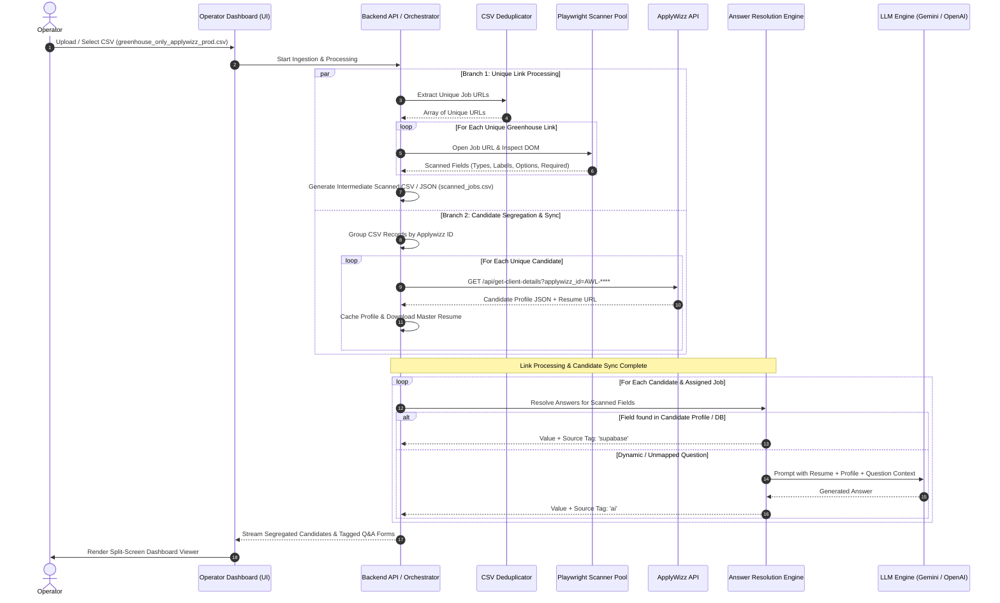

# Workflow & Sequence — Greenhouse Job Application Automation V1

## 1. End-to-End Workflow Architecture

The V1 system implements the two-branch architecture scoped in `job_injection_workflow.md` and `job_application_flowcharts.md` (Lines 25–57):

---

## 2. Detailed Step-by-Step Execution

### Step 1: Input CSV Ingestion
1. Operator loads `greenhouse_only_applywizz_prod(in).csv` via Dashboard or CLI trigger.
2. The CSV stream parser reads rows: `Date`, `Applywizz ID`, `Client Name`, `url`, `score`, `scored_jobId`, `status`.
3. Validates required columns and builds internal entity map.

### Step 2: Branch 1 — Unique Link Extraction & Playwright Scanning
1. **Deduplication:** Aggregates all job URLs across thousands of rows down to distinct URLs.
2. **Parallel Worker Pool:** Playwright workers (3–5 concurrent instances) launch headless Chromium sessions.
3. **DOM Scanning:**
   - Navigates to job application page.
   - Extracts Company Name and Job Title from heading elements.
   - Identifies all interactive input elements:
     - Standard inputs (`first_name`, `last_name`, `email`, `phone`, `resume`, `linkedin`).
     - Dynamic text inputs and textareas.
     - Custom single-select and multi-select dropdowns (`<select>` and custom `div` dropdowns with options extracted).
     - Radio button groups (e.g. Work authorization, Relocation).
     - Checkbox confirmations.
   - Flags expired / closed / 404 job postings.
4. **Intermediate Persistence:** Saves structured form templates to `output/scanned_jobs.csv` and `output/scanned_jobs.json`.

### Step 3: Branch 2 — Candidate Segregation & ApplyWizz Profile Sync
1. **Segregation:** Groups CSV rows by unique `Applywizz ID` (AWL id).
2. **ApplyWizz API Sync:**
   - Calls `https://www.apply-wizz.me/api/get-client-details?applywizz_id=AWL-****`.
   - Parses personal details, email, phone, location, work authorization, education history, and skills.
   - Downloads candidate resume from `resume_url` and stores to `./resumes/${applywizz_id}_resume.pdf`.

### Step 4: Answer Resolution & Tag Source Assignment
For each candidate and each assigned job:
1. Retrieves the scanned questions template from Step 2.
2. For each field:
   - **Direct Profile / Supabase Match:** If candidate profile or stored database attributes answer the field (e.g. name, email, phone, work authorization) $\rightarrow$ Value populated, Tag assigned: `supabase`.
   - **AI Synthesis:** If field is an open-ended/behavioral question $\rightarrow$ Prompts LLM with candidate profile context + resume text + job description $\rightarrow$ Synthesized response populated, Tag assigned: `ai`.
3. Marks candidate job status as `READY_FOR_REVIEW`.

### Step 5: Operator Dashboard Rendering
1. Dashboard loads segregated candidate directory in Left Pane.
2. Selecting a candidate displays their job queue and live scanned form in Right Pane.
3. All form questions appear pre-populated with visual badges:
   - 🟢 `supabase`
   - 🟣 `ai`

---

## 3. Error Handling & Edge Cases

| Scenario | System Behavior |
| :--- | :--- |
| **Dead / 404 / Expired Link** | Scanner marks job template as `EXPIRED`; Candidate job status marked `Expired` on dashboard. |
| **ApplyWizz API Rate Limit / Network Failure** | Exponential backoff retry (3 attempts); fallbacks to cached profile if available. |
| **Complex Custom Dropdown / React Select** | Scanner evaluates hidden input values and options list in DOM tree. |
| **Missing Candidate Resume in API** | Form viewer displays warning badge on file upload question. |
| **LLM Key Missing / Timeout** | Field marked `unresolved` with prompt to configure LLM API key in settings. |
