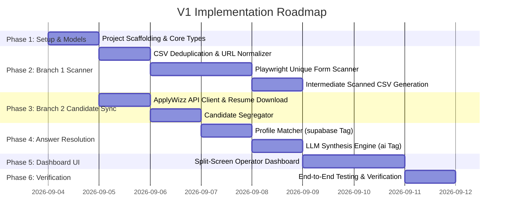

# Implementation Plan — Greenhouse Job Application Automation V1

## 1. Implementation Roadmap & Phase Breakdown



---

## 2. Phase-by-Phase Details

### Phase V1-1: Project Scaffolding & Core Types
- **Goal:** Set up Node.js / TypeScript environment with strict typing, configuration management, and directory structure.
- **Key Files:**
  - `package.json`, `tsconfig.json`
  - `src/types/index.ts` (ScannedField, ScannedJobTemplate, ApplyWizzProfile, ResolvedField, CandidateJobQueueItem)
  - `src/config/env.ts` (LLM API keys, timeout configs, worker concurrency)
- **Checkpoint:** Project compiles with zero TypeScript errors.

---

### Phase V1-2: Branch 1 — CSV Deduplication & Playwright Scanner
- **Goal:** Ingest `greenhouse_only_applywizz_prod(in).csv`, extract unique URLs, and scan form fields with Playwright.
- **Key Files:**
  - `src/scanner/csvDeduplicator.ts` — Reads CSV, normalizes URLs, yields unique URLs list.
  - `src/scanner/playwrightScanner.ts` — Launches headless browser pool, navigates to each unique URL, extracts form inputs/labels/options/types, handles 404/expired jobs.
  - `src/scanner/exportScannedJobs.ts` — Serializes results to `output/scanned_jobs.csv` and `output/scanned_jobs.json`.
- **Checkpoint:** Running scanner on sample Greenhouse URLs successfully extracts all form questions and writes structured output.

---

### Phase V1-3: Branch 2 — ApplyWizz API Sync & Candidate Segregation
- **Goal:** Segregate CSV rows by `Applywizz ID` and sync candidate profiles and master resumes.
- **Key Files:**
  - `src/candidate/applywizzClient.ts` — Axios client querying `https://www.apply-wizz.me/api/get-client-details?applywizz_id=...` and downloading PDF resumes to `./resumes/`.
  - `src/candidate/segregator.ts` — Groups CSV rows by candidate ID and links each candidate to their assigned job list.
- **Checkpoint:** Candidate profiles and resumes are fetched and cached locally with valid contact info and work authorization details.

---

### Phase V1-4: Answer Resolution Engine (`supabase` vs `ai` Tagging)
- **Goal:** Populate answers for each candidate's job application questions with strict source attribution.
- **Key Files:**
  - `src/resolver/profileMatcher.ts` — Maps standard profile attributes (name, email, phone, linkedin, visa) to form questions $\rightarrow$ sets `source: "supabase"`.
  - `src/resolver/llmSynthesizer.ts` — Connects to Google Gemini / OpenAI SDK; constructs prompt with candidate profile + resume + question text $\rightarrow$ sets `source: "ai"`.
  - `src/resolver/answerResolver.ts` — Orchestrates the multi-tier pipeline and produces `CandidateJobQueueItem` records.
- **Checkpoint:** Standard fields resolve with `supabase` tag; open-ended questions resolve with `ai` tag.

---

### Phase V1-5: Operator Dashboard UI (Split-Screen Viewer)
- **Goal:** Provide a responsive split-screen dashboard to view segregated candidates, job queues, and tagged Q&A.
- **Key Files:**
  - `src/server/index.ts` — Express REST API serving candidate queues and job forms.
  - `dashboard/` — React Native / Web application:
    - `CandidateList.tsx` — Left pane listing segregated candidates with search and job counters.
    - `JobQueueView.tsx` — Right pane top tab bar showing candidate's jobs.
    - `FormRenderer.tsx` — Right pane dynamic form rendering with green `supabase` and purple `ai` badges.
- **Checkpoint:** Operator can select any candidate, switch job tabs, and inspect all pre-populated questions and source badges.

---

### Phase V1-6: End-to-End Pipeline Integration & Verification
- **Goal:** Execute full pipeline from CSV ingestion to dashboard rendering.
- **Verification Commands:**
  ```powershell
  # 1. Run deduplication & unique link scan
  npm run scan -- --input="greenhouse_only_applywizz_prod(in).csv"
  
  # 2. Sync candidates & resolve answers
  npm run resolve
  
  # 3. Start dashboard & API server
  npm run start:dashboard
  ```
- **Checkpoint:** All candidates and jobs from the input CSV are fully processed, resolved, and accurately rendered in the dashboard.
