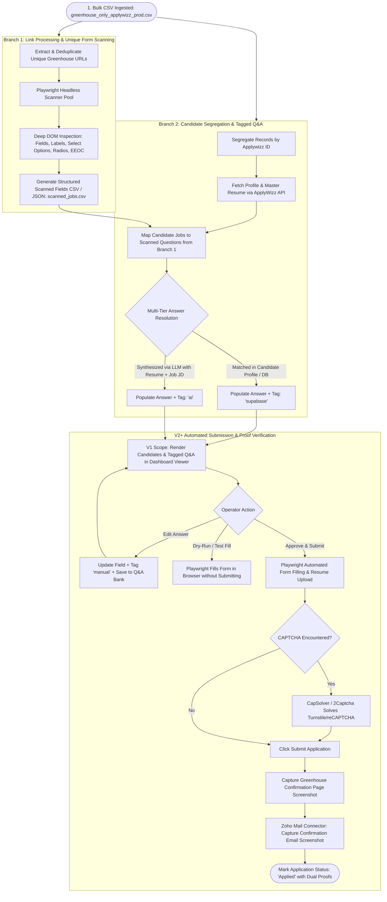

# Master Goal Document: Greenhouse Job Application Automation System

**Project:** Greenhouse Job Application Automation  
**Repository:** `yaswanthnaidu-yalla-applywizz/greehouse_apply`  
**Target ATS:** **Greenhouse Exclusively** (`boards.greenhouse.io`, `job-boards.greenhouse.io`, `app.greenhouse.io/embed/...`, custom company subdomains, and `grnh.se/...` shortlinks)  
**Status:** Authoritative Full-Scope Master Specification  

---

## 1. Executive Summary & Vision

The **Greenhouse Job Application Automation System** is an industrial-grade, multi-tenant operator automation platform built to streamline and automate high-volume job applications on Greenhouse ATS. 

The system solves the labor-intensive bottleneck of applying to hundreds of Greenhouse job openings for diverse candidates by:
1. Ingesting bulk candidate-job mappings from CSV (`greenhouse_only_applywizz_prod(in).csv`).
2. Executing a **Two-Branch Pipeline**:
   - **Branch 1 (Unique Link Processing & Scanning):** Deduplicating job URLs across all candidates and running a parallel Playwright browser pool to scan form fields, questions, input types, and dropdown options **exactly once per unique URL**.
   - **Branch 2 (Candidate Segregation & Tagged Q&A Resolution):** Segregating rows by candidate `Applywizz ID`, fetching candidate profiles and master resumes from the ApplyWizz API, mapping each candidate's jobs to the scanned questions from Branch 1, and auto-resolving answers with strict source attribution:
     - **`supabase`** for candidate profile data and historical database answers.
     - **`ai`** for LLM-synthesized answers (Gemini / OpenAI).
3. Providing a responsive **React Native Split-Screen Dashboard** for operators to inspect candidate queues, review pre-populated forms, and trigger automated submissions.
4. Executing headless/headful form submissions with automated file uploads, CAPTCHA bypass, and capturing **dual-channel verification proof** (Webpage confirmation screenshot + Zoho Mail confirmation email screenshot).

---

## 2. End-to-End System Flowchart



---

## 3. Product Roadmap by Versions & Phases

```
┌──────────────────────────────────────────────────────────────────────────────────────────────────┐
│                                 PRODUCT VERSIONING ROADMAP                                       │
├───────────────────────────────┬──────────────────────────────────┬───────────────────────────────┤
│          VERSION 1            │            VERSION 2             │           VERSION 3           │
│   (Ingestion, Scan & Viewer)  │     (Submission & Verification)  │     (Scale & Cloud Backend)   │
├───────────────────────────────┼──────────────────────────────────┼───────────────────────────────┤
│ • Bulk CSV Stream Ingestion   │ • Interactive Operator Review    │ • Queue Worker Pool (3-8 DLQ) │
│ • Branch 1: Unique URL Scan   │ • 'manual' Tagging & Q&A Bank    │ • Supabase PostgreSQL & RLS   │
│ • Branch 2: Candidate Segreg. │ • Playwright Auto-Fill Engine    │ • Supabase Storage Buckets    │
│ • ApplyWizz API Sync & Resume │ • Dry-Run Simulation Mode        │ • Automated CAPTCHA Solving   │
│ • Tagged Q&A ('supabase'/'ai')│ • Webpage Proof Capture          │ • Railway Residential Proxies │
│ • Split-Screen Dashboard      │ • Zoho Mail Email Proof Capture  │ • Multi-Tenant Operator RBAC  │
└───────────────────────────────┴──────────────────────────────────┴───────────────────────────────┘
```

### Version 1 (V1) — Ingestion, Scanning, Tagged Q&A & Dashboard Viewer
*(Strictly corresponds to Lines 25–57 in `job_application_flowcharts.md`)*
- **Objective:** Provide instant visibility into parsed candidate queues and pre-populated job forms with accurate source attribution.
- **Scope & Deliverables:**
  1. Ingestion of `greenhouse_only_applywizz_prod(in).csv`.
  2. Branch 1: URL deduplication, Playwright headless scan of unique links, and generation of `output/scanned_jobs.csv`.
  3. Branch 2: Segregation by `Applywizz ID`, ApplyWizz API candidate sync, master resume PDF download to `./resumes/`.
  4. Multi-tier Answer Resolution with strict tagging:
     - `supabase` for profile/database fields.
     - `ai` for LLM-generated responses.
  5. React Native / Web Split-Screen Operator Dashboard displaying segregated candidate lists and pre-populated forms with visual source badges.

### Version 2 (V2) — Submission Engine, Inline Review & Dual Proof Verification
*(Corresponds to Lines 59–67 in `job_application_flowcharts.md`)*
- **Objective:** Enable automated form submissions, interactive review, and multi-channel verification proofs.
- **Scope & Deliverables:**
  1. **Inline Review & Editing:** Operators can override answers in the dashboard; edits are tagged as `manual` and optionally saved to candidate Q&A bank for continuous learning.
  2. **Automated Playwright Form Filler:** Fills all text inputs, textareas, custom selects, radio buttons, and uploads the candidate's master resume PDF.
  3. **Dry-Run Mode:** Fills the form live in a visible browser without clicking the final submit button.
  4. **Dual-Channel Proof Capture:**
     - **Web Proof:** Full-page screenshot of the Greenhouse submission success page (`"Thank you for applying..."`).
     - **Email Proof:** Searches Zoho Mail via `zohomailconnector` for the confirmation email matching the company/job and captures a full email screenshot.
  5. **Status Tracking:** Updates application statuses (`Ready for Review` $\rightarrow$ `Applying` $\rightarrow$ `Applied` | `Failed` | `Expired`).

### Version 3 (V3) — Enterprise Cloud Scale, CAPTCHA & Resilience
- **Objective:** Cloud-native, high-concurrency unattended operation with anti-bot resilience.
- **Scope & Deliverables:**
  1. **Supabase Cloud Migration:** Migration from local CSV/JSON cache to Supabase PostgreSQL schema, Supabase Storage buckets (`resumes`, `screenshots_web`, `screenshots_email`), and Realtime subscriptions.
  2. **Automated CAPTCHA Solving:** Integrated CapSolver / 2Captcha API for automated Cloudflare Turnstile and Google reCAPTCHA solving.
  3. **Residential Proxy Pool:** Integration of Railway residential proxies to bypass IP rate limits.
  4. **Background Queue Daemon:** Node.js queue worker with `SELECT ... FOR UPDATE SKIP LOCKED` handling 3–8 concurrent worker instances.
  5. **Multi-Tenant Operator RBAC:** Role-based access control and team analytics.

---

## 4. Tag Source Taxonomy & Resolution Hierarchy

Every field rendered in the job application form must have an unambiguous source tag:

| Source Tag | Definition | Resolution Rule | Examples |
| :--- | :--- | :--- | :--- |
| **`supabase`** | Sourced directly from candidate profile or stored database tables. | Match against candidate profile attributes (Name, Email, Phone, Location, LinkedIn, Visa, Education, Experience). | First Name, Last Name, Email, Phone, "Are you authorized to work in the US?", LinkedIn URL. |
| **`ai`** | Synthesized dynamically by an LLM (Gemini / OpenAI). | Unmapped or open-ended custom question $\rightarrow$ LLM prompt with Candidate Profile + Resume Text + Job Description. | "Why do you want to join our engineering team?", "Describe your experience with React Native". |
| **`manual`** | Modified or entered directly by the operator *(V2+)*. | Operator manually edits an input field on the dashboard. | Operator corrects a typo or overrides an answer before submission. |

---

## 5. System Requirements & Operational Constraints

### 5.1 ATS Compatibility Constraints
- **Target ATS:** Exclusively Greenhouse.
- **URL Formats Supported:**
  - Standard job board: `https://job-boards.greenhouse.io/<company>/jobs/<id>`
  - Legacy job board: `https://boards.greenhouse.io/<company>/jobs/<id>`
  - Embed form: `https://app.greenhouse.io/embed/job_app?token=<token>`
  - Shortlink redirects: `https://grnh.se/<token>` (must resolve to target board before scanning)
  - Custom vanity domains: `https://careers.<company>.com/jobs/<id>` powered by Greenhouse iframe.

### 5.2 Anti-Bot & Rate Limiting Constraints
- **Scanning Jitter:** 3–6 seconds randomized delay between consecutive page loads on the same domain.
- **Retry Mechanism:** 3 retries with exponential backoff on network timeouts or rate limits (HTTP 429).
- **Proxy Routing:** Configurable residential proxies for batch scanning large volumes.

### 5.3 Candidate Data & Resume Storage Constraints
- **ApplyWizz API:** `https://www.apply-wizz.me/api/get-client-details?applywizz_id=AWL-****` (public JSON API).
- **Resume Binary:** Downloaded directly from `resume_url` provided by the ApplyWizz payload and saved as `${applywizzId}_resume.pdf`.
- **Integrity Guarantee:** Zero cross-candidate data contamination; job applications strictly isolated by `applywizz_id`.

---

## 6. Architecture & Data Contracts

### 6.1 Input Data Contract (`greenhouse_only_applywizz_prod(in).csv`)
```csv
Date,Applywizz ID,Client Name,url,score,scored_jobId,status
2/9/2026,AWL-36144,Sai Palutla,https://grnh.se/lcrm1uib2us,0,1984_4332117,PENDING
2/9/2026,AWL-28737,Sai Lokesh Veeravalli,https://grnh.se/u9oxssne3us,0,1596_4331359,PENDING
2/9/2026,AWL-32063,Sarada Gopu,https://app.greenhouse.io/embed/job_app?token=8095921&gh_src=be8ebc4b1,0,1846_4332363,PENDING
```

### 6.2 Intermediate Scanned Fields Schema (Branch 1 Output)
```json
{
  "job_url": "https://job-boards.greenhouse.io/doordashusa/jobs/7990832",
  "company_name": "DoorDash",
  "job_title": "Senior Frontend Engineer",
  "scanned_at": "2026-09-04T10:00:00Z",
  "is_expired": false,
  "fields": [
    {
      "field_id": "first_name",
      "name": "job_application[first_name]",
      "type": "text",
      "label": "First Name *",
      "is_required": true
    },
    {
      "field_id": "work_authorization",
      "name": "job_application[answers_attributes][0][boolean_value]",
      "type": "radio",
      "label": "Are you legally authorized to work in the United States? *",
      "is_required": true,
      "options": ["Yes", "No"]
    },
    {
      "field_id": "custom_question_123",
      "name": "job_application[answers_attributes][1][text_value]",
      "type": "textarea",
      "label": "Why DoorDash? *",
      "is_required": true
    }
  ]
}
```

### 6.3 Resolved Candidate Application Schema (Branch 2 Output)
```json
{
  "applywizz_id": "AWL-36144",
  "client_name": "Sai Palutla",
  "job_url": "https://job-boards.greenhouse.io/doordashusa/jobs/7990832",
  "company_name": "DoorDash",
  "job_title": "Senior Frontend Engineer",
  "status": "READY_FOR_REVIEW",
  "resolved_fields": [
    {
      "field_id": "first_name",
      "label": "First Name",
      "type": "text",
      "value": "Sai",
      "source": "supabase",
      "confidence": 1.0
    },
    {
      "field_id": "work_authorization",
      "label": "Are you legally authorized to work in the United States?",
      "type": "radio",
      "value": "Yes",
      "source": "supabase",
      "confidence": 1.0
    },
    {
      "field_id": "custom_question_123",
      "label": "Why DoorDash?",
      "type": "textarea",
      "value": "I am passionate about building scalable, high-performance web applications...",
      "source": "ai",
      "confidence": 0.92
    }
  ]
}
```

---

## 7. Project Documentation Index

All detailed technical and design documents are maintained in the [`project docs/`](file:///C:/Users/yaswa/Dev/greehouse_apply/project%20docs) directory:

| Document | Purpose |
| :--- | :--- |
| **[`01-prd.md`](file:///C:/Users/yaswa/Dev/greehouse_apply/project%20docs/01-prd.md)** | Product Requirements Document for V1 (Core objectives, features, success metrics). |
| **[`02-trd.md`](file:///C:/Users/yaswa/Dev/greehouse_apply/project%20docs/02-trd.md)** | Technical Requirements Document (Node.js/Playwright/TS architecture, interface contracts). |
| **[`03-workflow.md`](file:///C:/Users/yaswa/Dev/greehouse_apply/project%20docs/03-workflow.md)** | Two-Branch Ingestion Workflow, sequence diagrams, and lifecycle steps. |
| **[`04-ui-ux.md`](file:///C:/Users/yaswa/Dev/greehouse_apply/project%20docs/04-ui-ux.md)** | Split-Screen Operator Dashboard UI/UX layout, candidate list, and tagged form renderer. |
| **[`05-backend-schema.md`](file:///C:/Users/yaswa/Dev/greehouse_apply/project%20docs/05-backend-schema.md)** | Data formats, intermediate CSV/JSON schemas, and future Supabase PostgreSQL DDL. |
| **[`06-implementation.md`](file:///C:/Users/yaswa/Dev/greehouse_apply/project%20docs/06-implementation.md)** | Phased V1 implementation roadmap, verification commands, and milestones. |
| **[`job_injection_workflow.md`](file:///C:/Users/yaswa/Dev/greehouse_apply/project%20docs/job_injection_workflow.md)** | Core two-branch architectural flowchart. |
| **[`job_application_flowcharts.md`](file:///C:/Users/yaswa/Dev/greehouse_apply/project%20docs/job_application_flowcharts.md)** | V1 vs V2+ flowcharts and workflow boundaries. |
| **[`requirement_interview_for_context_persistence.md`](file:///C:/Users/yaswa/Dev/greehouse_apply/project%20docs/requirement_interview_for_context_persistence.md)** | Authoritative requirement interview transcript and context log. |
