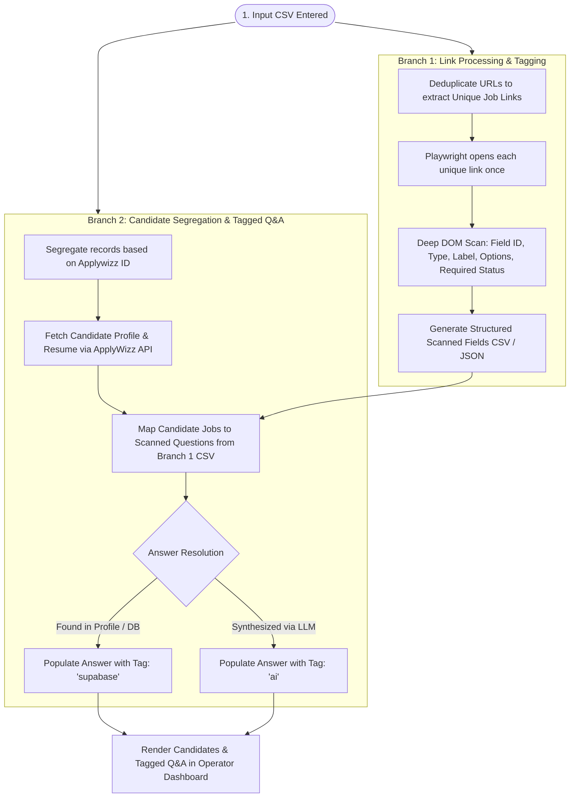

# Requirement Interview for Context Persistence

**Project Name:** Greenhouse Job Application Automation  
**Repository:** `yaswanthnaidu-yalla-applywizz/greehouse_apply`  
**Date & Status:** 2026-09-04 | Corrected & Aligned — Ready for Phased Execution

---

## 1. Executive Summary & Core Objective
A high-throughput operator automation system designed to ingest bulk CSV files containing candidate-job mappings (`Applywizz ID` + Greenhouse Job URLs), execute a two-branch ingestion & scanning pipeline, auto-sync candidate profile details and resumes via the ApplyWizz API, deduplicate and scan Greenhouse job application forms using Playwright, auto-populate application fields using a multi-tiered Q&A resolution pipeline with accurate source tagging (`supabase` vs `ai`), and render candidate job queues and resolved form questions in an operator dashboard.

---

## 2. Scope Breakdown by Versions & Phases

### **Version 1 (V1) — Ingestion, Scanning, Tagged Q&A & Dashboard Viewer**
*(Corresponds to Flowchart 2, Lines 25–57 in `job_application_flowcharts.md` and `job_injection_workflow.md`)*
1. **CSV Ingestion & Entity Extraction:** Read input CSV (`greenhouse_only_applywizz_prod(in).csv`) containing `Applywizz ID`, `Client Name`, and `url`.
2. **Branch 1 (Unique Link Processing & Scanning):**
   - Deduplicate all job URLs across the batch to identify distinct Greenhouse links.
   - Playwright opens each unique job URL once to deeply inspect DOM fields, input types, labels, required flags, and dropdown options.
   - Generate structured intermediate CSV / JSON file representing the scanned fields per unique job link.
3. **Branch 2 (Candidate Segregation & Q&A Association):**
   - Segregate input records by `Applywizz ID` (AWL id).
   - Query ApplyWizz API (`/api/get-client-details?applywizz_id=...`) to retrieve candidate profile information and master resume.
   - For each candidate-job pair, pull the scanned questions from Branch 1's intermediate CSV.
   - Resolve candidate-specific answers:
     - **Tag: `supabase`** — Answer sourced from candidate profile / historical data in Supabase (or local database/cache).
     - **Tag: `ai`** — Answer synthesized via LLM using candidate profile + resume + job context.
4. **Operator Dashboard Viewer:**
   - Left Pane: Segregated candidate list with AWL IDs, names, and job counts.
   - Right Pane: Selected candidate's job list and live form questions with tagged answers (`supabase` badge / `ai` badge).

---

### **Next Versions (V2+) — Submission, Review, Proofs & Advanced Features**
*(Corresponds to Flowchart 2, Lines 59–67)*
1. **Interactive Review & Inline Editing:** Allow operators to modify answers before applying, with changes tagged as `manual` and optionally saved to the candidate's persistent Q&A bank.
2. **Automated Submission Engine:** Playwright automated form filling, file uploads, dry-run simulations, and live submissions.
3. **CAPTCHA Handling:** CapSolver / 2Captcha integration for Turnstile / reCAPTCHA.
4. **Proof & Verification:** Multi-channel proof capturing (Webpage confirmation screenshot + Zoho Mail confirmation email screenshot).
5. **Persistent Cloud Backend:** Full migration of local CSV/JSON cache to Supabase PostgreSQL, Auth, and Storage buckets.

---

## 3. Two-Branch Data Ingestion & Deduplication Architecture

---

## 4. Answer Resolution & Tag Source Taxonomy

| Tag | Source Definition | Example Scenarios |
| :--- | :--- | :--- |
| **`supabase`** | Any data field resolved directly from candidate profile attributes or historical Q&A bank stored in Supabase / Database. | First Name, Last Name, Email, Phone, LinkedIn URL, Visa Status, Work Authorization, Address. |
| **`ai`** | Any answer generated dynamically by an LLM (Gemini / OpenAI / Anthropic) using candidate resume text + profile + job description context. | "Why do you want to work here?", "Describe your experience with distributed systems", custom behavioral questions. |
| **`manual`** | *(V2+)* Any answer modified or entered directly by the human operator on the review dashboard. | Operator corrects a typo or overrides an AI-generated response. |

---

## 5. Structured Data Schemas

### Input CSV Schema (`greenhouse_only_applywizz_prod(in).csv`)
- `Date`: Application batch date
- `Applywizz ID`: Candidate ID (e.g. `AWL-36144`)
- `Client Name`: Candidate full name
- `url`: Greenhouse application URL
- `score`: Match/relevance score
- `scored_jobId`: Job reference identifier
- `status`: Processing status

### Intermediate Scanned Fields CSV / JSON Schema (Branch 1 Output)
- `job_url`: Unique Greenhouse job application URL
- `company_name`: Target company parsed from URL / page header
- `job_title`: Position title
- `fields`: Array of scanned questions:
  - `field_id`: DOM element ID or name
  - `name`: Form input name attribute (e.g. `job_application[first_name]`)
  - `type`: `text` | `textarea` | `select` | `radio` | `checkbox` | `file` | `location_autocomplete`
  - `label`: Human-readable question prompt (e.g. "Are you authorized to work in the US?")
  - `is_required`: Boolean
  - `options`: Array of selectable choices (for `select` / `radio`)

### Resolved Candidate Job Schema (Branch 2 Output)
- `applywizz_id`: Candidate ID
- `candidate_name`: Candidate name
- `job_url`: Target job URL
- `form_fields`: Array of resolved fields:
  - `field_id`: Target field ID
  - `label`: Question label
  - `type`: Input type
  - `value`: Resolved answer value
  - `source`: `"supabase"` | `"ai"` | `"manual"`
  - `confidence`: Resolution confidence score
