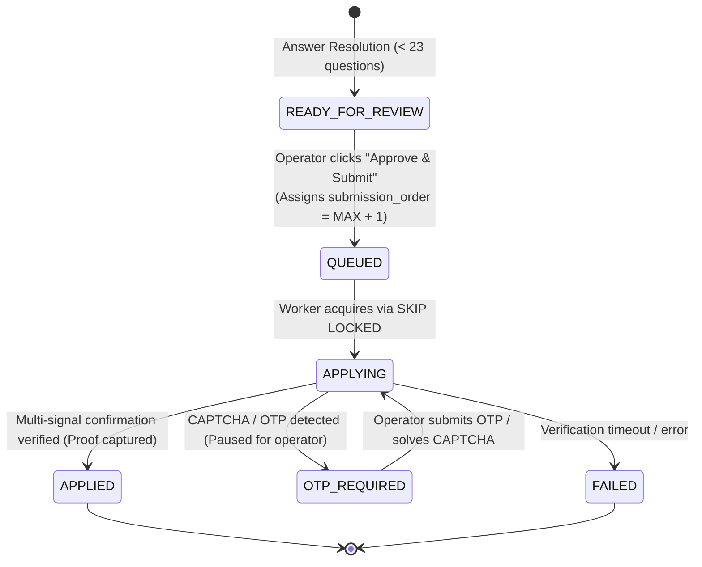

# Implementation Plan — Round-Robin Queue Scheduler & Submission Daemon (Synthesized Plan)

## Goal Description

Implement an asynchronous **Submission Queue & Background Daemon** that supports **60 concurrent users (CAs)** with up to **3 concurrent Playwright submitter workers**, fair multi-user distribution, and atomic queue scheduling.

### Architecture Comparison & Synthesis

| Aspect | User's Specification | Our Earlier Proposal | Synthesized Best Design |
| :--- | :--- | :--- | :--- |
| **Queue Trigger** | Operator clicks "Approve & Submit" | Auto-queue on sign-in | **On Operator "Approve & Submit"**: Fast, non-blocking HTTP response (`status: 'QUEUED'`). Operator can immediately review the next job. |
| **Sequencing** | Global `submission_order` (`MAX + 1`) | Round-robin formula by user slot | **Global `submission_order` with User Tracking**: Assign `submission_order = MAX + 1` globally. Also store `assigned_ca_email`. |
| **Concurrency & Workers** | 2 concurrent Playwright workers (max 3) | 2 workers | **2–3 Concurrent Workers**: Configurable via `WORKER_CONCURRENCY=2` (max 3), respecting Railway container memory constraints. |
| **Atomic Locking** | `SELECT ... FOR UPDATE SKIP LOCKED` | Supabase update | **Atomic PostgreSQL RPC (`get_next_queued_application`)**: Uses `FOR UPDATE SKIP LOCKED` to guarantee zero race conditions across concurrent workers. |
| **Fairness / Anti-Starvation** | Implicitly distributed via staggered submissions | Explicit interleaving | **Staggered Arrival + User Balancing**: Primary sort by `submission_order ASC`. If an operator rapidly queues 10 jobs at once, round-robin tie-breaking guarantees interleaved processing so other operators are never starved. |
| **Deployment** | `npm run daemon` alongside server or separate service | Single server | **Dual Deployment Support**: Can run embedded via `ENABLE_QUEUE_WORKER=true` (single Railway container) OR as a standalone `npm run daemon` service. |

---

## Queue Lifecycle & State Transition Diagram



---

## User Review Required

> [!IMPORTANT]
> **Database Migration (`src/db/schema.sql` & new migration file)**:
> 1. Adds `submission_order INTEGER` to `candidate_applications`.
> 2. Adds `'QUEUED'` to the `candidate_applications.status` check constraint.
> 3. Creates index `idx_applications_queued ON candidate_applications (status, submission_order) WHERE status = 'QUEUED'`.
> 4. Creates atomic stored procedure `get_next_queued_application()` in PostgreSQL with `FOR UPDATE SKIP LOCKED`.

> [!IMPORTANT]
> **Dashboard UX Change**:
> - Previously, clicking "Approve & Submit" held the HTTP request open for 30–60s while Playwright executed live submission.
> - With the queue daemon, clicking "Approve & Submit" responds in **< 100ms** with `status: 'QUEUED'`. The dashboard displays a `QUEUED` badge and polls status changes, allowing operators to rapidly review and approve their ~5 candidates without freezing the browser.

---

## Open Questions

> [!NOTE]
> 1. **Railway Deployment Mode**:
>    - **Option A (Recommended for cost/simplicity)**: Run the daemon embedded in the existing Express server process when `ENABLE_QUEUE_WORKER=true`. No extra Railway service needed.
>    - **Option B (Dedicated service)**: Create a second Railway service running `npm run daemon:prod` while the web service runs `node dist/server/index.js`.
>    *The code will support both out of the box via an environment variable.*
>
> 2. **Worker Concurrency Default**:
>    - Default to `WORKER_CONCURRENCY=2` (max 3). Each Playwright Chromium instance consumes ~350MB RAM. 2 workers $\approx$ 700MB + 200MB Node = ~900MB (well within Railway's 2GB-4GB limits).

---

## Proposed Changes

### Component 1: Database Schema & Migration

#### [MODIFY] [src/db/schema.sql](file:///C:/Users/yaswa/Dev/greehouse_apply/src/db/schema.sql)
- Expand `candidate_applications.status` check constraint to include `'QUEUED'`.
- Add column `submission_order INTEGER`.
- Add column `assigned_ca_email TEXT`.
- Create partial index on `candidate_applications(submission_order)` where `status = 'QUEUED'`.
- Create PostgreSQL function:
  ```sql
  CREATE OR REPLACE FUNCTION get_next_queued_application()
  RETURNS SETOF candidate_applications AS $$
  DECLARE
      selected_row candidate_applications%ROWTYPE;
  BEGIN
      SELECT * INTO selected_row
      FROM candidate_applications
      WHERE status = 'QUEUED'
      ORDER BY submission_order ASC
      LIMIT 1
      FOR UPDATE SKIP LOCKED;

      IF FOUND THEN
          UPDATE candidate_applications
          SET status = 'APPLYING', updated_at = now()
          WHERE id = selected_row.id;

          selected_row.status := 'APPLYING';
          RETURN NEXT selected_row;
      END IF;
      RETURN;
  END;
  $$ LANGUAGE plpgsql;
  ```

#### [NEW] [src/db/migrations/005_round_robin_queue.sql](file:///C:/Users/yaswa/Dev/greehouse_apply/src/db/migrations/005_round_robin_queue.sql)
- Idempotent migration script executing the above DDL on existing Supabase instances.

---

### Component 2: DB Access Layer

#### [MODIFY] [src/db/applications.ts](file:///C:/Users/yaswa/Dev/greehouse_apply/src/db/applications.ts)
- Update `ApplicationStatus` union type to include `'QUEUED'`.
- Update `ApplicationRow` interface with `submission_order?: number | null` and `assigned_ca_email?: string | null`.
- Add `enqueueApplication(applicationId: string, assignedCaEmail?: string): Promise<{ submissionOrder: number }>`:
  - Executes `SELECT COALESCE(MAX(submission_order), 0) + 1 AS next_order FROM candidate_applications WHERE status IN ('QUEUED', 'APPLYING', 'APPLIED', 'FAILED')`.
  - Atomically updates application with `status = 'QUEUED'`, `submission_order = next_order`, `assigned_ca_email`.
- Add `getNextQueuedApplicationForRoundRobin(): Promise<ApplicationRow | null>`:
  - Invokes `supabase.rpc('get_next_queued_application')` with fallback to atomic query.
  - In-memory fallback for local offline testing (finds lowest `submission_order` with `status === 'QUEUED'`, marks `'APPLYING'`).

---

### Component 3: Submission Endpoint Queue Insertion

#### [MODIFY] [src/server/routes/submissions.ts](file:///C:/Users/yaswa/Dev/greehouse_apply/src/server/routes/submissions.ts)
- Update `POST /api/applications/:id/submit`:
  - When operator clicks "Approve & Submit", instead of running `runLiveSubmit` synchronously, it calls `enqueueApplication(appId, userEmail)`.
  - Returns HTTP 200:
    ```json
    {
      "success": true,
      "status": "QUEUED",
      "applicationId": "...",
      "submissionOrder": 42,
      "message": "Application queued for submission."
    }
    ```
  - Also supports an optional query parameter `?sync=true` if direct synchronous execution is ever needed for debugging.

---

### Component 4: Background Queue Worker Daemon

#### [NEW] [src/submitter/queueWorker.ts](file:///C:/Users/yaswa/Dev/greehouse_apply/src/submitter/queueWorker.ts)
- Daemon managing up to 3 concurrent Playwright workers (default 2):
  ```typescript
  export class SubmissionQueueDaemon {
    private concurrency: number; // 2 (max 3)
    private isRunning: boolean = false;
    private pollIntervalMs: number = 2000;

    constructor(concurrency: number = 2) {
      this.concurrency = Math.min(3, Math.max(1, concurrency));
    }

    public async start(): Promise<void> { ... }
    public async stop(): Promise<void> { ... }
    private async runWorker(workerId: number): Promise<void> { ... }
  }
  ```
- Each worker loop:
  1. Calls `getNextQueuedApplicationForRoundRobin()`.
  2. If none found, sleeps 2000ms.
  3. If found, logs `[Worker ${workerId}] Submitting application ${app.id} (Order: ${app.submission_order})...` to `stderr`.
  4. Calls `runLiveSubmit(app.id, { headless: true })`.
  5. Updates application status to `APPLIED`, `FAILED`, or `OTP_REQUIRED`.
  6. Logs completion to `stderr`.
  7. Sleeps 2000ms before next poll.
- Handles `SIGTERM` and `SIGINT` for clean process teardown.
- Auto-runs if invoked via CLI: `if (process.argv[1].includes('queueWorker')) main();`

---

### Component 5: Server Integration & Railway Scripts

#### [MODIFY] [package.json](file:///C:/Users/yaswa/Dev/greehouse_apply/package.json)
- Add scripts:
  - `"daemon": "tsx src/submitter/queueWorker.ts"`
  - `"daemon:prod": "node dist/submitter/queueWorker.js"`

#### [MODIFY] [src/server/index.ts](file:///C:/Users/yaswa/Dev/greehouse_apply/src/server/index.ts)
- If `process.env.ENABLE_QUEUE_WORKER === 'true'`, initialize and start `SubmissionQueueDaemon` on server boot.
- Attach shutdown hooks to stop workers gracefully when server terminates.

#### [MODIFY] [railway.json](file:///C:/Users/yaswa/Dev/greehouse_apply/railway.json)
- Ensure container startup supports both embedded worker mode and separate daemon service.

---

### Component 6: Verification & Simulation Script

#### [NEW] [scripts/test_queue_round_robin.ts](file:///C:/Users/yaswa/Dev/greehouse_apply/scripts/test_queue_round_robin.ts)
- Automated verification script using fixture data:
  - Creates 60 mock users, 10 applications each (600 applications total).
  - Simulates staggered "Approve & Submit" clicks across all 60 users.
  - Runs 2 concurrent simulated workers calling `getNextQueuedApplicationForRoundRobin()`.
  - Asserts that:
    1. Applications are processed in `submission_order` sequence.
    2. No two workers ever acquire the same application.
    3. Every user gets fair, steady progress with zero starvation.

---

## Verification Plan

### Automated Tests
1. **Schema Migration**:
   ```powershell
   npm run db:migrate
   ```
2. **TypeScript Compilation Check**:
   ```powershell
   npm run build
   ```
3. **Queue Selection & Anti-Starvation Simulation**:
   ```powershell
   npx tsx scripts/test_queue_round_robin.ts
   ```

### Manual Verification
1. Open the dashboard, navigate to an application, and click "Approve & Submit".
2. Confirm the response is instant (< 100ms) and the status badge transitions to `QUEUED`.
3. In the terminal running the daemon, verify log on `stderr`:
   `[Worker 1] Submitting application <id> (Order: 1)...`
4. Confirm Playwright headless submit executes and status transitions to `APPLIED` with screenshot proof attached.
